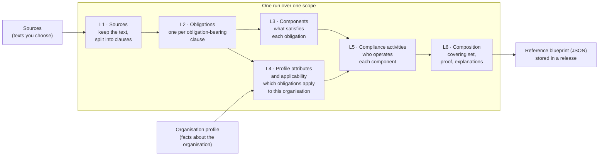

# CLHEAR

**CLHEAR turns the regulatory texts you choose, plus a short description of an organisation, into a reference blueprint for compliance.** The blueprint is the set of components that covers every obligation in those texts that applies to that organisation. Every obligation, component, role, condition and compliance activity in it is quoted from those texts, and whatever the texts do not support is reported, with the kind of source that would.

A statute is long. A compliance program has to answer a shorter question: *for an organisation of this shape, what must be in place, and which clause says so?* CLHEAR is an open, self-hosted engine for that question. You bring the texts: a law, a regulation, a standard, an internal policy.

- **Grounded in the texts, and only the texts.** Every record carries an evidence chain: quotes of the clause it came from, with offsets. Each run checks them all again (`lineage`). No sector vocabulary is built in, so a hospital's, a bank's and a factory's texts each raise their own questions.
- **Honest about what is missing.** When the texts cannot support a record (a component the obligation does not name, a role no text defines, a licensing regime that is not in scope), the blueprint says so in `evidence_gaps` and recommends which source to add. It never guesses.
- **Accounted for.** Every obligation in scope ends up in one of four states: covered by a component, a gap, not applicable (with the answer that ruled it out), or undetermined (with the question you have not answered yet).
- **Irredundant.** No component can be removed without leaving an obligation uncovered, and the blueprint carries that proof.
- **Diffable.** When a text or the organisation changes, you can see which components appeared, which dropped, and which obligations changed state.
- **Yours.** CLHEAR ships with **no texts loaded**, runs on a laptop or in a private network, and keeps its data in one database.

---

## Contents

- [How it works](#how-it-works)
- [The five things you work with](#the-five-things-you-work-with)
- [Try it in two minutes (offline)](#try-it-in-two-minutes-offline)
- [Run it on your own texts](#run-it-on-your-own-texts)
- [Reading a blueprint](#reading-a-blueprint)
- [Is this blueprint credible? A checklist](#is-this-blueprint-credible-a-checklist)
- [Comparing blueprints and getting notified](#comparing-blueprints-and-getting-notified)
- [Command line reference](#command-line-reference)
- [HTTP API reference](#http-api-reference)
- [Configuration](#configuration)
- [What CLHEAR stores, and what it does not](#what-clhear-stores-and-what-it-does-not)
- [Deploy, pin a version, contribute](#deploy-pin-a-version-contribute)

More detail: [docs/how-it-works.md](docs/how-it-works.md) (each layer, and the rules it applies) and [docs/install.md](docs/install.md) (database, model, container, AWS). A complete walkthrough lives in [examples/security-baseline](examples/security-baseline).

---

## How it works



In plain words, a run:

1. **Reads** each text in the scope, keeps it verbatim, and splits it into clauses along the text's own structure: parts, articles, sections, numbered paragraphs, list items.
2. **Finds the obligations.** A clause states an obligation when it says someone *must*, *shall*, *is required to* or *is prohibited from* doing something. Obligations of public bodies (an authority, a department, a court), definitions and procedure are left out. Weaker wording ("should") goes to the model, which must quote the words it relied on. Each obligation's subject, action and condition are stored as quotes of the clause.
3. **Names components in the text's words.** A component is what the obligation tells the addressee to do or to have ("keep a log of security incidents"). The model may group obligations under one component, but a name is kept only if every word of it is in the cited clauses. An obligation that names nothing concrete gets no invented component: it becomes a gap with a recommendation.
4. **Asks the questions the texts raise.** An obligation's applicability conditions become questions for the organisation: the jurisdiction its source declares, the role it is addressed to ("the controller", "a covered entity", "every employer"), and its own "where / if / unless" clause when that clause is about the addressee ("where an organisation processes personal data"). An obligation applies when every question is answered and matches; a question with no answer leaves the obligation undetermined.
5. **Composes the reference blueprint.** CLHEAR takes every component an obligation requires, then picks the fewest extra components that cover the rest, removes anything redundant, proves it, and explains each element with the obligations it cites and their quotes. Before composing, every derived record is checked against the clause text again (the anchoring check); anything that fails is withheld and listed.

Where the model fits: clause text is stored exactly as read and the model never rewrites it. Obligation detection, applicability and composition are deterministic rules; the same inputs give the same blueprint. The model triages weak obligations, splits hard sentences, groups obligations under components, reads licence types and fills characteristics, and each answer is kept only when it is the text's own words. Every step that uses it records which model answered.

## The five things you work with

| Object | What it is | Example |
| --- | --- | --- |
| **Source** | One text: pasted, a file, or a URL. Give it a short `key`, a `jurisdiction` if the text is law somewhere specific, and its publisher (`issuer`) if you know it. | `gdpr` (EU), `iso-controls` (no jurisdiction) |
| **Scope** | A named list of sources that belong in one program. | `privacy-program` → `[gdpr, dpa-guidance]` |
| **Organisation profile** | The organisation's answers to the questions the texts raise: its profile attribute values. | `acme` → `{"jurisdictions": ["EU"], "roles": ["controller"], "conditions": {"processes personal data": true}}` |
| **Run** | One execution over a scope for one or more profiles. Queued, then run by a worker. | `run_…` |
| **Release** | The stored result of a finished run: one **reference blueprint** per profile. | `rel_…` |

**Profiles answer the texts' questions.** There is no fixed list of organisation types. After a scope has been built once, `GET /v1/profile-schema?scope=<name>` lists the questions its applicability conditions raise, each with the quotes it came from:

| Field | What it answers | Effect |
| --- | --- | --- |
| `jurisdictions` | Where the organisation operates (a list) | Obligations from a source with a declared jurisdiction apply only if it is listed. Sources with no jurisdiction apply everywhere. |
| `roles` | Which addressees the texts name it is, e.g. `["controller"]`, or `{"processor": false}` to say no | An obligation addressed to "the controller" applies when you are one. "Every organisation" or "any person" raises no question. |
| `conditions` | Facts the obligations depend on, by their words or their `COND-` id, e.g. `{"processes personal data": true}` | An obligation with "where an organisation processes personal data" applies when that is true ("unless …" when it is false). |
| `licences` | Licence types you hold, from those the texts in scope establish | Recorded; an obligation addressed to a licence holder is asked as a role. |

An unanswered question never silently includes or excludes an obligation: the obligation is **undetermined** and the blueprint lists the question under `open_questions`. `PUT /v1/profiles/{id}` checks the shape; a run warns about answers no text in scope asks for (`profile_warnings`).

Profiles describe the *kind* of organisation, never its people, controls or evidence.

## Try it in two minutes (offline)

Python 3.12. This runs entirely on your machine with a stand-in model (`fake`) and writes a **sample** blueprint (marked `"sample": true`) so you can see the shape before connecting a real model.

```bash
pip install "clhear @ git+https://github.com/Reg42-ai/clhear.git"

export CLHEAR_LLM_PROVIDER=fake
clhear init         # creates an empty ./scopes directory
clhear doctor       # checks the database and the model
clhear quickstart   # writes a sample source, scope and profile, then runs them
clhear export --release <release_id from quickstart> --profile example-profile
```

`doctor` prints `"live_run": "blocked"` with `fake`. That is expected: the sample never reads a real text.

## Run it on your own texts

[docs/quickstart-your-sources.md](docs/quickstart-your-sources.md) walks the whole path with the `clhear` command alone: register your texts, read the questions they raise and the candidate organisation profiles, answer them, read the blueprint, and add the sources each layer asks for. The steps below do the same over the HTTP API.

### 1. Connect a model

| `CLHEAR_LLM_PROVIDER` | Also set | Default model |
| --- | --- | --- |
| `anthropic` | `ANTHROPIC_API_KEY` | `claude-opus-5` |
| `openai_compatible` | `OPENAI_BASE_URL`, `OPENAI_API_KEY` | `gpt-4o` |
| `bedrock` | `BEDROCK_MODEL_ID` (or `CLHEAR_LLM_MODEL`) and AWS credentials | none |

`CLHEAR_LLM_MODEL` picks another model. For Claude, `CLHEAR_LLM_EFFORT` (`low` … `max`, default `medium`) sets how hard the model thinks. On Claude Opus 5 a request the model declines is retried on a fallback model server-side; set `CLHEAR_LLM_FALLBACKS=false` to turn that off.

```bash
export CLHEAR_LLM_PROVIDER=anthropic ANTHROPIC_API_KEY=sk-ant-...
clhear doctor --check-model     # makes one small real call; exits non-zero on a bad key or model
```

### 2. Start the API and a worker

```bash
clhear serve     # HTTP API on http://127.0.0.1:8000
clhear worker    # runs queued builds
```

On `127.0.0.1` the API needs no token. To bind anything else, set `CLHEAR_SERVICE_TOKENS` (comma-separated, so you can rotate) or `CLHEAR_SERVICE_TOKEN_FILE`, and send `Authorization: Bearer <token>`.

### 3. Register sources, and check what CLHEAR read

| You have | `adapter` | `locator` |
| --- | --- | --- |
| Text to paste | `local_text` | `{"text": "…"}` (add `"format": "html"` for pasted HTML) |
| A text, HTML or PDF file | `local_text` | `{"path": "gdpr.pdf"}`, relative to `CLHEAR_LOCAL_SOURCES_DIR` (default `./sources`) |
| A public web page or PDF | `url` | `{"url": "https://…"}` (https only; private addresses are refused) |
| An EU act, a UK act, US Code / eCFR | `eur_lex`, `uk_legislation`, `govinfo_us` | see `GET /v1/adapters` |

```bash
curl -s -X POST localhost:8000/v1/sources -H 'content-type: application/json' -d '{
  "key": "baseline", "adapter": "local_text", "name": "Security baseline",
  "jurisdiction": "EU", "locator": {"path": "baseline.txt"}}'

curl -s -X POST localhost:8000/v1/sources/baseline/test-fetch
# {"clauses": 16, "preview": [{"clause_ref": "sec-1", "text": "Section 1. Every organisation shall appoint …"}, …]}
```

`test-fetch` reads the source with the real adapter and writes nothing. Look at the preview: those `clause_ref`s are what every blueprint will cite. A scanned PDF has no text layer; run OCR first.

### 4. Name the scope and describe the organisation

The questions come from the texts, so a first run with an empty profile (`{"attributes": {}}`) is a good way to see them: its blueprint lists every question under `open_questions`, and `GET /v1/profile-schema?scope=security-baseline` shows them with their quotes. Answer them in the profile and run again.

```bash
curl -s -X POST localhost:8000/v1/scopes -H 'content-type: application/json' \
  -d '{"name": "security-baseline", "sources": ["baseline"]}'

curl -s -X PUT localhost:8000/v1/profiles/payments-startup -H 'content-type: application/json' \
  -d '{"name": "Payments start-up", "attributes": {"jurisdictions": ["EU"], "roles": ["management body"],
       "conditions": {"processes personal data": true}}}'
# the response includes "validation": {"valid": true, "errors": [], "warnings": []}
```

### 5. Run, then read the blueprint

```bash
curl -s -X POST localhost:8000/v1/runs -H 'content-type: application/json' \
  -d '{"scope": "security-baseline", "profiles": ["payments-startup"]}'
# {"run_id": "run_…", "status": "queued"}
```

Poll `GET /v1/runs/{run_id}` until `"status"` is `"succeeded"` or `"failed"` (a failed run carries its reason in `error`, for example which source could not be read). Then:

```bash
curl -s localhost:8000/v1/releases/$RELEASE_ID/blueprints/payments-startup
```

The same run from the command line, once source, scope and profile exist: `clhear run --scope security-baseline --profile-id payments-startup`.

### 6. Add the sources the layers ask for

A layer with nothing in scope to derive its records from says so. Each blueprint and release carries `source_advice`: for every such layer, what is missing, which kinds of official source would supply it (for example enforcement actions and penalty notices for L7 risk scoring, or the regulator's FAQs, guidance, court decisions and the remediation its enforcement actions order for L8 practices), and the source `kind` to register each as. When a clause cites a text the scope does not hold ("section 2 of the Harbour Lighting Act 2019", "under Part 7"), the advice names that text as the clause words it, with the clauses that cite it. Each blueprint also carries a `source_inventory`: every source in scope and every text their clauses cite, each `derived`, `pending` or `unresolved`. `GET /v1/scopes/{name}/advice` and `clhear sources advise --scope <name>` return the same. `GET /v1/profile-schema?scope=<name>` also lists `candidates`: candidate organisation profiles built from the roles and licence types quoted from your texts, to start a profile from.

[examples/security-baseline/run.sh](examples/security-baseline/run.sh) does all of this for one text and two organisations, and prints both blueprints.

## Reading a blueprint

```json
{
  "scope": {"name": "security-baseline", "source_keys": ["baseline"]},
  "items": [
    {
      "name": "Review user access rights", "kind": "Process", "basis": "required",
      "obligations_satisfied": ["OBL:baseline#sec-4/b"],
      "evidence": {"name": [{"clause_ref": "sec-4/b", "start": 4, "end": 29, "quote": "review user access rights"}]},
      "characteristics": [{"key": "cadence", "value": "at least every six months", "evidence": [{"quote": "at least every six months", "…": "…"}]}],
      "explanation": "Review user access rights (Process BLK-…) is required by OBL:baseline#sec-4/b. … The text (baseline sec-4/b): \"(b) review user access rights at least every six months;\""
    }
  ],
  "coverage": [
    {"source_key": "baseline", "clause_ref": "sec-4/b", "state": "covered", "satisfied_by": ["BLK-…"],
     "duty": "Organisation shall review user access rights at least every six months.",
     "evidence": {"clause_id": 7, "start": 0, "end": 56, "quote": "(b) review user access rights at least every six months;"}}
  ],
  "not_applicable": [
    {"clause_ref": "sec-5",
     "because": [{"requires": {"condition": "COND-…", "fact": "processes personal data", "expect": true},
                  "evidence": {"condition": [{"quote": "Where an organisation processes personal data", "…": "…"}]}}]}
  ],
  "undetermined": [],
  "open_questions": [],
  "evidence_gaps": [
    {"layer": "L4", "kind": "role_undefined", "subject": "role:management body",
     "recommendation": "The texts use 'management body' but no definition of it is in scope. Add the definitions section …"},
    {"layer": "L7", "kind": "no_enforcement_sources", "recommendation": "No enforcement source is in scope … Add the regulator's published enforcement actions or decisions."}
  ],
  "coverage_summary": {"covered": 7, "gaps": 0, "total": 7, "not_applicable": 1, "undetermined": 0},
  "minimality": {"checked": true, "minimal": true}
}
```

- **`items`**: the elements of the blueprint, one component each, named in the text's words (`evidence.name` quotes them). `basis` is `required` when an obligation calls for that component, and `selected` when the composer chose it to cover remaining obligations. `characteristics` (cadence, owner, retention …) appear only when a clause states them, with the quote.
- **`coverage`**: every obligation that applies, with its quote (`evidence`: clause, offsets, exact words) and its `state`: `covered`, or `gap` when the text names no component for it. `triggers` lists conditions that time the obligation ("when an incident occurs") rather than decide whether it applies.
- **`not_applicable`**: obligations ruled out by an answer, with the failed condition and its quote.
- **`undetermined`** and **`open_questions`**: obligations that depend on a question the profile did not answer, and those questions, each with its quote. Answer them and run again.
- **`evidence_gaps`**: what the texts in scope could not support, and which kind of source to add. Kinds: `unresolved_reference`, `no_measure`, `measure_name_rejected`, `characteristic_unspecified`, `role_undefined`, `no_licence_types`, `operator_not_stated`, `no_enforcement_sources`, `no_reference_sources`.
- **`source_inventory`**: every source in scope and every text their clauses cite, each `derived` (read and built), `pending` (registered, not built) or `unresolved` (cited, not registered).
- **`minimality`**: `minimal: true` means no component can be removed without opening a gap. The full proof is in `proof`.

Every quote is `{"clause_id", "source_key", "clause_ref", "start", "end", "quote"}`, and `quote` is exactly the clause text between `start` and `end`. The release (`GET /v1/releases/{id}`) carries `lineage`: how many derived records were checked against the clause text, how many held, and any that did not (those are withheld from the blueprint). Obligation ids (`OBL:<source>#<clause_ref>`) and component ids (`BLK-…`) are stable.

## Is this blueprint credible? A checklist

1. **The text was read as you expect.** `test-fetch` shows clause refs that match the document's own numbering.
2. **Nothing failed silently.** The release lists `failed_sources` (should be empty). Each layer reports `model_calls` with `ok` and `failed`, and a layer where every model call failed fails the run.
3. **Every record is anchored.** In the release, `lineage.unanchored` is empty and `lineage.rows` equals `lineage.anchored`.
4. **Every obligation has a state.** `coverage_summary.total + not_applicable + undetermined` equals the obligations found in the scope. Gaps are shown, not hidden.
5. **No open questions remain** you meant to answer, and each not-applicable reason matches the organisation.
6. **Read the evidence gaps.** Each one names a source to add. Adding it and running again is how a blueprint gets more complete.
7. **Spot-check a few quotes** against the source document. They are the clause text itself, not generated.
8. **Treat groupings as proposals.** Which obligations share a component comes from the model (in the text's words); the obligations they cite and the proof that they cover them are mechanical. A person should review the program before it is adopted.

## Comparing blueprints and getting notified

**Diff:** `GET /v1/blueprints/{blueprint_id}/diff?against={other_id}` shows components added or dropped and obligations that changed state.

**Webhooks:** register a URL and secret with `POST /v1/webhooks`. Deliveries carry `X-CLHEAR-Event` and `X-CLHEAR-Signature: sha256=<HMAC-SHA256 of the body>`. Events: `run.started`, `run.finished`, `run.failed`, `source.failed`, `release.published`, `blueprint.changed`. A failed delivery never fails the run.

## Command line reference

| Command | What it does |
| --- | --- |
| `clhear init` | Create the empty `scopes/` directory |
| `clhear doctor [--check-model]` | Check the database and model configuration; optionally make one real model call |
| `clhear migrate` | Apply database migrations (other commands also do this on first use) |
| `clhear version` | Print the engine tag |
| `clhear quickstart` | Write and run the offline sample |
| `clhear serve [--host --port]` | Serve the HTTP API |
| `clhear worker [--once] [--poll SECONDS]` | Process queued runs |
| `clhear run --scope S --profile-id P [--queue-only]` | Run a scope for stored profiles and store the release |
| `clhear build --scope S [--profile FILE]` | Build every layer for a scope and print the layer report |
| `clhear compose --profile P` | Compose a blueprint for a stored engine profile from what is already built |
| `clhear export --release R --profile P [--out FILE]` | Write one blueprint as JSON |
| `clhear release --release R [--out DIR]` | Write a whole stored release to a directory |
| `clhear validate FILE [--contribution]` | Check a profile or a contribution proposal |
| `clhear sources add KEY (--url U \| --path F \| --text-file F) [--kind K --jurisdiction J --publisher P --name N --reference R]` | Register a source (`--reference`: the publisher's own reference for it, so texts that cite it resolve) |
| `clhear sources list` / `clhear sources test KEY` | List sources; preview what a source's adapter reads, storing nothing |
| `clhear sources advise --scope S [--json]` | Which official sources to add, per layer |
| `clhear scope create NAME SOURCE...` | Name a scope |
| `clhear profile questions --scope S [--json]` | The questions a built scope raises, and candidate organisation profiles |
| `clhear profile set ID [--file F \| --jurisdiction --role --not-role --condition fact=true --licence]` | Store a profile |
| `clhear blueprint show --release R --profile P` | A blueprint as readable text |

## HTTP API reference

The full contract is [openapi/clhear-v1.yaml](openapi/clhear-v1.yaml).

| Method and path | Purpose |
| --- | --- |
| `GET /v1/health`, `GET /v1/version` | Liveness; engine, API and schema versions |
| `GET /v1/adapters` | What can be registered as a source, and the locator each adapter needs |
| `GET/POST /v1/sources`, `GET/PUT/DELETE /v1/sources/{key}` | Manage sources |
| `POST /v1/sources/{key}/test-fetch` | Read a source with its adapter and preview its clauses; stores nothing |
| `GET/POST /v1/scopes`, `GET /v1/scopes/{name}` | Manage scopes |
| `GET /v1/profile-schema?scope=…` | Profile fields, and the roles, conditions and licences that scope's texts raise, with quotes |
| `GET/PUT /v1/profiles/{profile_id}` | Manage profiles; `PUT` returns validation errors and warnings |
| `POST /v1/runs`, `GET /v1/runs/{run_id}`, `GET /v1/runs/{run_id}/logs` | Start and follow runs |
| `GET /v1/releases/{release_id}` | A stored release, with per-layer counts, model calls, failed sources and the lineage check |
| `GET /v1/releases/{release_id}/blueprints/{profile_id}` | One blueprint in a release |
| `GET /v1/blueprints/{blueprint_id}`, `GET /v1/blueprints/{blueprint_id}/diff?against=…` | A blueprint by id, and the difference between two |
| `GET/POST /v1/webhooks`, `DELETE /v1/webhooks/{webhook_id}` | Manage notifications |
| `POST /v1/contributions/validate` | Check a contribution proposal (no network calls) |

## Configuration

| Variable | Default | Purpose |
| --- | --- | --- |
| `DATABASE_URL` | `sqlite:///./clhear.db` | SQLite file or `postgresql+psycopg://…` |
| `CLHEAR_LLM_PROVIDER` | unset | `anthropic`, `openai_compatible`, `bedrock` or `fake` |
| `CLHEAR_LLM_MODEL` | provider default | Model name |
| `CLHEAR_LLM_EFFORT` | `medium` | Claude reasoning effort: `low`, `medium`, `high`, `xhigh`, `max` |
| `CLHEAR_LLM_FALLBACKS` | `true` | Server-side refusal fallbacks on Claude Opus 5 / Fable |
| `ANTHROPIC_API_KEY`, `OPENAI_BASE_URL`, `OPENAI_API_KEY`, `BEDROCK_MODEL_ID` | unset | Provider credentials |
| `CLHEAR_LOCAL_SOURCES_DIR` | `./sources` | Where `local_text` `path` sources are read from (nothing outside it) |
| `CLHEAR_ALLOW_PRIVATE_URLS` | unset | Set `1` to let `url` sources reach private addresses |
| `CLHEAR_HTTP_MODE` | `replay` | Set `live` for the publisher adapters (`eur_lex`, `uk_legislation`, `govinfo_us` …); `url` sources always fetch live |
| `CLHEAR_SCOPES_DIR` | `scopes` | Where scope files live |
| `CLHEAR_ARTIFACTS_DIR` | `./artifacts` | Where read texts are kept |
| `CLHEAR_BIND_HOST`, `CLHEAR_PORT` | `127.0.0.1`, `8000` | Where `serve` listens |
| `CLHEAR_SERVICE_TOKENS`, `CLHEAR_SERVICE_TOKEN_FILE` | unset | Bearer tokens, required off loopback |

**Model spend is capped** at $20 per layer per day (`CLHEAR_GATEWAY_FLEET_DAILY_CAP_USD`) and $100 per day overall (`CLHEAR_GATEWAY_GLOBAL_DAILY_CAP_USD`). A short standard costs cents to a few dollars; a long regulation with hundreds of obligations can reach the per-layer cap. Raise the caps before such a run, or use a lower `CLHEAR_LLM_EFFORT`. A capped call counts as a failed model call in the layer report, and a layer where every call failed fails the run, so a cap never produces a silently thin blueprint.

## What CLHEAR stores, and what it does not

The database holds the texts you supplied (as read), the obligations, components, applicability conditions and compliance activities derived from them with their quotes, the evidence gaps, the profiles you submitted, and the releases. Nothing else is loaded: no sector catalogue, register or sample organisation. Firm identity, the controls you already run, owners and evidence stay in your own systems.

## Deploy, pin a version, contribute

**Install:** `pip install "clhear @ git+https://github.com/Reg42-ai/clhear.git@vX.Y.Z"` pins a release; without `@…` you get `main`.

**Containers** are published as `ghcr.io/reg42-ai/clhear` (`linux/amd64`, `linux/arm64`) for each release tag. Mount your files at `/sources`. Postgres, the container and an optional private AWS task are covered in [docs/install.md](docs/install.md). Changes per version: [CHANGELOG.md](CHANGELOG.md).

**Contributing.** Pull requests are welcome under the [contributor terms](CONTRIBUTING.md). Run the same checks as CI:

```bash
pip install -e ".[dev]"
ruff check .
python -m app.clhear.denylist
python -m app.clhear.openapi_doc --check
python -m pytest tests -q
```

The engine tests run the whole live path (HTTP API, worker, every layer) against a scripted stand-in model, so they need no key and no network.

**Security issues:** see [SECURITY.md](SECURITY.md).

## License

[AGPL-3.0-only](LICENSE). If you run a modified CLHEAR as a network service, that counts as distribution under this license: the people who use the service are entitled to the corresponding source.
