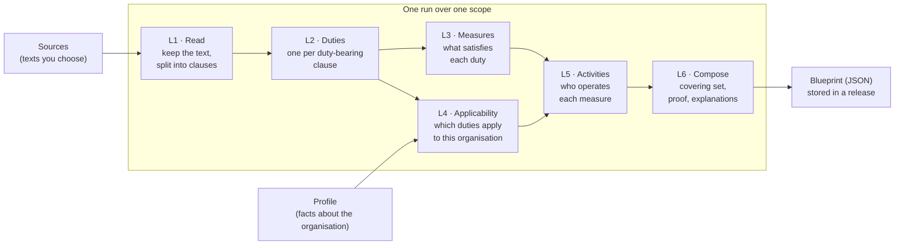

# CLHEAR

**CLHEAR turns the regulatory texts you choose, plus a short description of an organisation, into a compliance blueprint.** The blueprint is the set of measures that covers every duty in those texts that applies to that organisation. Every measure points back to the clause that requires it.

A statute is long. A compliance program has to answer a shorter question: *for an organisation of this shape, what must be in place, and which clause says so?* CLHEAR is an open, self-hosted engine for that question. You bring the texts: a law, a regulation, a standard, an internal policy.

- **Traceable.** Every duty names its source and clause, and every measure names the duties it satisfies.
- **Accounted for.** Every duty in scope ends up in one of three states. It is covered by a measure, reported as a gap, or listed as not applicable together with the fact it did not meet.
- **Irredundant.** No measure can be removed without leaving a duty uncovered, and the blueprint carries that proof.
- **Diffable.** When a text or the organisation changes, you can see which measures appeared, which dropped, and which duties changed state.
- **Yours.** CLHEAR ships with **no texts loaded**, runs on a laptop or in a private network, and keeps its data in one database.

---

## Contents

- [How it works](#how-it-works)
- [The five things you work with](#the-five-things-you-work-with)
- [Try it in two minutes (offline)](#try-it-in-two-minutes-offline)
- [Run it on your own texts](#run-it-on-your-own-texts)
- [Reading a blueprint](#reading-a-blueprint)
- [Is this blueprint credible? A checklist](#is-this-blueprint-credible-a-checklist)
- [Comparing blueprints and getting notified](#comparing-blueprints-and-getting-notified)
- [Command line reference](#command-line-reference)
- [HTTP API reference](#http-api-reference)
- [Configuration](#configuration)
- [What CLHEAR stores, and what it does not](#what-clhear-stores-and-what-it-does-not)
- [Deploy, pin a version, contribute](#deploy-pin-a-version-contribute)

More detail: [docs/how-it-works.md](docs/how-it-works.md) (each layer, and the rules it applies) and [docs/install.md](docs/install.md) (database, model, container, AWS). A complete walkthrough lives in [examples/security-baseline](examples/security-baseline).

---

## How it works



In plain words, a run:

1. **Reads** each text in the scope, keeps it verbatim, and splits it into clauses along the text's own structure: parts, articles, sections, numbered paragraphs, list items.
2. **Finds the duties.** A clause is a duty when it says someone *must*, *shall*, *is required to* or *is prohibited from* doing something. Powers of authorities, definitions and procedure are left out. Weaker wording ("should") goes to the model, which must quote the words it relied on.
3. **Designs measures.** The model proposes a concrete measure (a process, a record, a role, a system, a policy) for each group of duties. It may only cite duties it was shown.
4. **Decides what applies.** A duty applies to your organisation when it passes every one of its conditions. These are the jurisdiction of its source, an addressee the text names (for example "the controller"), and the duty's own "where / if" clause. A duty with no conditions applies to everyone.
5. **Composes the blueprint.** CLHEAR takes every measure a duty requires, then picks the fewest extra measures that cover the rest, removes anything redundant, proves it, and explains each measure with the duties it cites.

Where the model fits: clause text is stored exactly as read and the model never rewrites it. Duty detection, applicability and composition are deterministic rules; the same inputs give the same blueprint. The model triages weak duties, refines duty structure, designs measures and reviews derivations. Every step that uses it records which model answered.

## The five things you work with

| Object | What it is | Example |
| --- | --- | --- |
| **Source** | One text: pasted, a file, or a URL. Give it a short `key`, and a `jurisdiction` if the text is law somewhere specific. | `gdpr` (EU), `iso-controls` (no jurisdiction) |
| **Scope** | A named list of sources that belong in one program. | `privacy-program` → `[gdpr, dpa-guidance]` |
| **Profile** | A few facts about the organisation. The facts decide which duties apply. | `acme` → `{"jurisdictions": ["EU"], "data_footprint": "customer records"}` |
| **Run** | One execution over a scope for one or more profiles. Queued, then run by a worker. | `run_…` |
| **Release** | The stored result of a finished run: one **blueprint** per profile. | `rel_…` |

**Profile facts.** Only these fields are accepted. `GET /v1/profile-schema` lists them with the values this install knows.

| Field | What it asks | What it changes |
| --- | --- | --- |
| `jurisdictions` | Where the organisation operates | Duties from a source with a jurisdiction apply only if it is listed |
| `data_footprint` | The personal data it handles, in words | Duties addressed to a controller or processor, or conditional on processing personal data, apply only when set |
| `authorisations` | Licences and permissions held | Duties addressed to "a firm" or "an authorised person" apply only when at least one is listed |
| `products` | What it offers | Duties conditional on a product (for example client money or custody) |
| `customer_base` | Whom it serves | Duties conditional on a client type (retail, professional …) |
| `channels` | How it reaches them | Duties conditional on a channel (online, intermediaries …) |
| `crypto_services` | `true` / `false` | Duties about crypto-assets |
| `financial_entity_dora` | `true` / `false` | Duties addressed to "financial entities" |

Profiles describe the *kind* of organisation, never its people, controls or evidence.

## Try it in two minutes (offline)

Python 3.12. This runs entirely on your machine with a stand-in model (`fake`) and writes a **sample** blueprint (marked `"sample": true`) so you can see the shape before connecting a real model.

```bash
pip install "clhear @ git+https://github.com/Reg42-ai/clhear.git"

export CLHEAR_LLM_PROVIDER=fake
clhear init         # creates an empty ./scopes directory
clhear doctor       # checks the database and the model
clhear quickstart   # writes a sample source, scope and profile, then runs them
clhear export --release <release_id from quickstart> --profile example-profile
```

`doctor` prints `"live_run": "blocked"` with `fake`. That is expected: the sample never reads a real text.

## Run it on your own texts

### 1. Connect a model

| `CLHEAR_LLM_PROVIDER` | Also set | Default model |
| --- | --- | --- |
| `anthropic` | `ANTHROPIC_API_KEY` | `claude-opus-5` |
| `openai_compatible` | `OPENAI_BASE_URL`, `OPENAI_API_KEY` | `gpt-4o` |
| `bedrock` | `BEDROCK_MODEL_ID` (or `CLHEAR_LLM_MODEL`) and AWS credentials | none |

`CLHEAR_LLM_MODEL` picks another model. For Claude, `CLHEAR_LLM_EFFORT` (`low` … `max`, default `medium`) sets how hard the model thinks. On Claude Opus 5 a request the model declines is retried on a fallback model server-side; set `CLHEAR_LLM_FALLBACKS=false` to turn that off.

```bash
export CLHEAR_LLM_PROVIDER=anthropic ANTHROPIC_API_KEY=sk-ant-...
clhear doctor --check-model     # makes one small real call; exits non-zero on a bad key or model
```

### 2. Start the API and a worker

```bash
clhear serve     # HTTP API on http://127.0.0.1:8000
clhear worker    # runs queued builds
```

On `127.0.0.1` the API needs no token. To bind anything else, set `CLHEAR_SERVICE_TOKENS` (comma-separated, so you can rotate) or `CLHEAR_SERVICE_TOKEN_FILE`, and send `Authorization: Bearer <token>`.

### 3. Register sources, and check what CLHEAR read

| You have | `adapter` | `locator` |
| --- | --- | --- |
| Text to paste | `local_text` | `{"text": "…"}` (add `"format": "html"` for pasted HTML) |
| A text, HTML or PDF file | `local_text` | `{"path": "gdpr.pdf"}`, relative to `CLHEAR_LOCAL_SOURCES_DIR` (default `./sources`) |
| A public web page or PDF | `url` | `{"url": "https://…"}` (https only; private addresses are refused) |
| An EU act, a UK act, US Code / eCFR | `eur_lex`, `uk_legislation`, `govinfo_us` | see `GET /v1/adapters` |

```bash
curl -s -X POST localhost:8000/v1/sources -H 'content-type: application/json' -d '{
  "key": "baseline", "adapter": "local_text", "name": "Security baseline",
  "jurisdiction": "EU", "locator": {"path": "baseline.txt"}}'

curl -s -X POST localhost:8000/v1/sources/baseline/test-fetch
# {"clauses": 16, "preview": [{"clause_ref": "sec-1", "text": "Section 1. Every organisation shall appoint …"}, …]}
```

`test-fetch` reads the source with the real adapter and writes nothing. Look at the preview: those `clause_ref`s are what every blueprint will cite. A scanned PDF has no text layer; run OCR first.

### 4. Name the scope and describe the organisation

```bash
curl -s -X POST localhost:8000/v1/scopes -H 'content-type: application/json' \
  -d '{"name": "security-baseline", "sources": ["baseline"]}'

curl -s -X PUT localhost:8000/v1/profiles/payments-startup -H 'content-type: application/json' \
  -d '{"name": "Payments start-up", "attributes": {"jurisdictions": ["EU"], "data_footprint": "customer names and emails"}}'
# the response includes "validation": {"valid": true, "errors": [], "warnings": []}
```

### 5. Run, then read the blueprint

```bash
curl -s -X POST localhost:8000/v1/runs -H 'content-type: application/json' \
  -d '{"scope": "security-baseline", "profiles": ["payments-startup"]}'
# {"run_id": "run_…", "status": "queued"}
```

Poll `GET /v1/runs/{run_id}` until `"status"` is `"succeeded"` or `"failed"` (a failed run carries its reason in `error`, for example which source could not be read). Then:

```bash
curl -s localhost:8000/v1/releases/$RELEASE_ID/blueprints/payments-startup
```

The same run from the command line, once source, scope and profile exist: `clhear run --scope security-baseline --profile-id payments-startup`.

[examples/security-baseline/run.sh](examples/security-baseline/run.sh) does all of this for one text and two organisations, and prints both blueprints.

## Reading a blueprint

```json
{
  "scope": {"name": "security-baseline", "source_keys": ["baseline"]},
  "items": [
    {
      "name": "Access review procedure",
      "basis": "required",
      "obligations_satisfied": ["OBL:baseline#sec-4/b", "OBL:baseline#sec-4/c"],
      "explanation": "Access review procedure (Process BLK-…) is required by OBL:baseline#sec-4/b, …"
    }
  ],
  "coverage": [
    {
      "source_key": "baseline", "clause_ref": "sec-4/b",
      "duty": "Every organisation shall review user access rights at least every six months.",
      "state": "covered", "satisfied_by": ["BLK-…"]
    }
  ],
  "not_applicable": [
    {"source_key": "baseline", "clause_ref": "sec-5",
     "because": [{"requires": {"data_footprint": "*"}, "basis": "condition",
                  "rationale": "condition: 'processes personal data'"}]}
  ],
  "coverage_summary": {"covered": 9, "gaps": 0, "total": 9, "not_applicable": 1},
  "minimality": {"checked": true, "minimal": true}
}
```

- **`items`**: the measures. `basis` is `required` when a duty calls for that measure, and `selected` when the composer chose it to cover remaining duties. `obligations_satisfied` lists the duties it answers.
- **`coverage`**: every duty that applies, with its sentence (`duty`), where it comes from (`source_key`, `clause_ref`), and its `state`: `covered`, or `gap` when no measure satisfies it yet.
- **`not_applicable`**: every duty in scope that does not apply to this profile, and the condition it failed.
- **`minimality`**: `minimal: true` means no measure can be removed without opening a gap. The full proof is in `proof`.

Duty ids (`OBL:<source>#<clause_ref>`) and measure ids (`BLK-…`) are stable.

## Is this blueprint credible? A checklist

1. **The text was read as you expect.** `test-fetch` shows clause refs that match the document's own numbering.
2. **Nothing failed silently.** The release lists `failed_sources` (should be empty). Each layer reports `model_calls` with `ok` and `failed`, and a layer where every model call failed fails the run.
3. **Every duty has a state.** `coverage_summary.total + not_applicable` equals the duties found in the scope. Gaps are shown, not hidden.
4. **Not-applicable has a reason** you can check against the profile.
5. **Spot-check a few duties** against the clause text they cite. The duty sentence is taken from the clause, not generated.
6. **Treat measures as proposals.** Measure names and groupings come from the model; the duties they cite and the proof that they cover them are mechanical. A person should review the program before it is adopted.

## Comparing blueprints and getting notified

**Diff:** `GET /v1/blueprints/{blueprint_id}/diff?against={other_id}` shows measures added or dropped and duties that changed state.

**Webhooks:** register a URL and secret with `POST /v1/webhooks`. Deliveries carry `X-CLHEAR-Event` and `X-CLHEAR-Signature: sha256=<HMAC-SHA256 of the body>`. Events: `run.started`, `run.finished`, `run.failed`, `source.failed`, `release.published`, `blueprint.changed`. A failed delivery never fails the run.

## Command line reference

| Command | What it does |
| --- | --- |
| `clhear init` | Create the empty `scopes/` directory |
| `clhear doctor [--check-model]` | Check the database and model configuration; optionally make one real model call |
| `clhear migrate` | Apply database migrations (other commands also do this on first use) |
| `clhear version` | Print the engine tag |
| `clhear quickstart` | Write and run the offline sample |
| `clhear serve [--host --port]` | Serve the HTTP API |
| `clhear worker [--once] [--poll SECONDS]` | Process queued runs |
| `clhear run --scope S --profile-id P [--queue-only]` | Run a scope for stored profiles and store the release |
| `clhear build --scope S [--profile FILE]` | Build every layer for a scope and print the layer report |
| `clhear compose --profile P` | Compose a blueprint for a stored engine profile from what is already built |
| `clhear export --release R --profile P [--out FILE]` | Write one blueprint as JSON |
| `clhear release --release R [--out DIR]` | Write a whole stored release to a directory |
| `clhear validate FILE [--contribution]` | Check a profile or a contribution proposal |

## HTTP API reference

The full contract is [openapi/clhear-v1.yaml](openapi/clhear-v1.yaml).

| Method and path | Purpose |
| --- | --- |
| `GET /v1/health`, `GET /v1/version` | Liveness; engine, API and schema versions |
| `GET /v1/adapters` | What can be registered as a source, and the locator each adapter needs |
| `GET/POST /v1/sources`, `GET/PUT/DELETE /v1/sources/{key}` | Manage sources |
| `POST /v1/sources/{key}/test-fetch` | Read a source with its adapter and preview its clauses; stores nothing |
| `GET/POST /v1/scopes`, `GET /v1/scopes/{name}` | Manage scopes |
| `GET /v1/profile-schema` | Profile fields, what each changes, and known values |
| `GET/PUT /v1/profiles/{profile_id}` | Manage profiles; `PUT` returns validation errors and warnings |
| `POST /v1/runs`, `GET /v1/runs/{run_id}`, `GET /v1/runs/{run_id}/logs` | Start and follow runs |
| `GET /v1/releases/{release_id}` | A stored release, with per-layer counts, model calls and failed sources |
| `GET /v1/releases/{release_id}/blueprints/{profile_id}` | One blueprint in a release |
| `GET /v1/blueprints/{blueprint_id}`, `GET /v1/blueprints/{blueprint_id}/diff?against=…` | A blueprint by id, and the difference between two |
| `GET/POST /v1/webhooks`, `DELETE /v1/webhooks/{webhook_id}` | Manage notifications |
| `POST /v1/contributions/validate` | Check a contribution proposal (no network calls) |

## Configuration

| Variable | Default | Purpose |
| --- | --- | --- |
| `DATABASE_URL` | `sqlite:///./clhear.db` | SQLite file or `postgresql+psycopg://…` |
| `CLHEAR_LLM_PROVIDER` | unset | `anthropic`, `openai_compatible`, `bedrock` or `fake` |
| `CLHEAR_LLM_MODEL` | provider default | Model name |
| `CLHEAR_LLM_EFFORT` | `medium` | Claude reasoning effort: `low`, `medium`, `high`, `xhigh`, `max` |
| `CLHEAR_LLM_FALLBACKS` | `true` | Server-side refusal fallbacks on Claude Opus 5 / Fable |
| `ANTHROPIC_API_KEY`, `OPENAI_BASE_URL`, `OPENAI_API_KEY`, `BEDROCK_MODEL_ID` | unset | Provider credentials |
| `CLHEAR_LOCAL_SOURCES_DIR` | `./sources` | Where `local_text` `path` sources are read from (nothing outside it) |
| `CLHEAR_ALLOW_PRIVATE_URLS` | unset | Set `1` to let `url` sources reach private addresses |
| `CLHEAR_HTTP_MODE` | `replay` | Set `live` for the publisher adapters (`eur_lex`, `uk_legislation`, `govinfo_us` …); `url` sources always fetch live |
| `CLHEAR_SCOPES_DIR` | `scopes` | Where scope files live |
| `CLHEAR_ARTIFACTS_DIR` | `./artifacts` | Where read texts are kept |
| `CLHEAR_CURATED_FINANCE` | unset | Set `1` before the first migration to seed the reviewed UK/EU/US financial-services ontology |
| `CLHEAR_BIND_HOST`, `CLHEAR_PORT` | `127.0.0.1`, `8000` | Where `serve` listens |
| `CLHEAR_SERVICE_TOKENS`, `CLHEAR_SERVICE_TOKEN_FILE` | unset | Bearer tokens, required off loopback |

**Model spend is capped** at $20 per layer per day (`CLHEAR_GATEWAY_FLEET_DAILY_CAP_USD`) and $100 per day overall (`CLHEAR_GATEWAY_GLOBAL_DAILY_CAP_USD`). A short standard costs cents to a few dollars; a long regulation with hundreds of duties can reach the per-layer cap. Raise the caps before such a run, or use a lower `CLHEAR_LLM_EFFORT`. A capped call counts as a failed model call in the layer report, and a layer where every call failed fails the run, so a cap never produces a silently thin blueprint.

## What CLHEAR stores, and what it does not

The database holds the texts you supplied (as read), the duties and measures derived from them, the profiles you submitted, and the releases. Firm identity, the controls you already run, owners and evidence stay in your own systems.

## Deploy, pin a version, contribute

**Install:** `pip install "clhear @ git+https://github.com/Reg42-ai/clhear.git@vX.Y.Z"` pins a release; without `@…` you get `main`.

**Containers** are published as `ghcr.io/reg42-ai/clhear` (`linux/amd64`, `linux/arm64`) for each release tag. Mount your files at `/sources`. Postgres, the container and an optional private AWS task are covered in [docs/install.md](docs/install.md). Changes per version: [CHANGELOG.md](CHANGELOG.md).

**Contributing.** Pull requests are welcome under the [contributor terms](CONTRIBUTING.md). Run the same checks as CI:

```bash
pip install -e ".[dev]"
ruff check .
python -m app.clhear.denylist
python -m app.clhear.openapi_doc --check
python -m pytest tests -q
```

The engine tests run the whole live path (HTTP API, worker, every layer) against a scripted stand-in model, so they need no key and no network.

**Security issues:** see [SECURITY.md](SECURITY.md).

## License

[AGPL-3.0-only](LICENSE). If you run a modified CLHEAR as a network service, that counts as distribution under this license: the people who use the service are entitled to the corresponding source.
