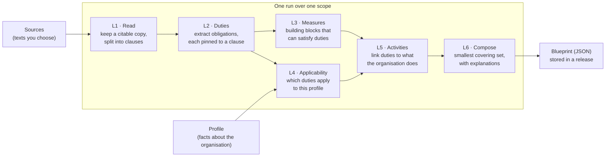

# CLHEAR

**CLHEAR turns the regulatory texts you choose, plus a short description of an organisation, into a compliance blueprint.** The blueprint is the smallest set of measures that covers every duty in those texts that applies to that organisation. Every measure points back to the clause that requires it.

A statute is long. A compliance program has to answer a shorter question: *for an organisation of this shape, what must be in place, and which clause says so?* CLHEAR is an open, self-hosted engine for that question.

- **Traceable.** Every measure names the duty it satisfies, the text it comes from, and the passage inside that text.
- **Minimal.** A measure stays only if removing it would leave a duty uncovered, and the blueprint carries the proof.
- **Diffable.** When a text or the organisation changes, you can ask which measures appeared, which dropped, and which duties changed state.
- **Yours.** CLHEAR ships with **no texts loaded**. You pick the corpus. One install and one database, on a laptop or inside a private network.

---

## Contents

- [How it works](#how-it-works)
- [The five things you work with](#the-five-things-you-work-with)
- [Try it in two minutes (offline)](#try-it-in-two-minutes-offline)
- [Use it on your own texts](#use-it-on-your-own-texts)
- [Reading a blueprint](#reading-a-blueprint)
- [Comparing blueprints and getting notified](#comparing-blueprints-and-getting-notified)
- [Command line reference](#command-line-reference)
- [HTTP API reference](#http-api-reference)
- [Configuration](#configuration)
- [What CLHEAR stores, and what it does not](#what-clhear-stores-and-what-it-does-not)
- [Deploy, pin a version, contribute](#deploy-pin-a-version-contribute)

More detail: [docs/how-it-works.md](docs/how-it-works.md) (the pipeline, layer by layer) and [docs/install.md](docs/install.md) (database, model, container, AWS).

---

## How it works



In plain words, a run:

1. **Reads** every text in the scope and keeps a verbatim, citable copy, split into clauses.
2. **Finds the duties** in those texts. Each duty is pinned to the exact clause that imposes it.
3. **Keeps the duties that apply** to the organisation described by the profile.
4. **Chooses the smallest set of measures** that still covers every applicable duty, then writes down why each one is there.

Where the model fits: clause text is stored exactly as published, and the model never rewrites it. Duty detection starts from deterministic rules. The model then helps triage and refine duties, design the measures that satisfy them, and word the explanations. Every derived object keeps a pointer back to its clause. The final composition is deterministic set-cover plus a minimality check, so the same inputs always give the same blueprint.

[docs/how-it-works.md](docs/how-it-works.md) walks through each layer.

## The five things you work with

| Object | What it is | Example |
| --- | --- | --- |
| **Source** | One text CLHEAR may read: a text you paste, a file on disk, or a URL from a publisher. You give it a short `key`. | `example-source` |
| **Scope** | A named list of sources that belong in one run. | `example-scope` → `[example-source]` |
| **Profile** | A handful of facts about the organisation the blueprint is for. The facts decide which duties apply. | `example-profile` |
| **Run** | One execution over a scope for one or more profiles. It is queued, then a worker picks it up. | `run_…` |
| **Release** | The stored result of a finished run: one **blueprint** per profile. | `rel_…` |

A **profile** accepts only these fields. Any other field is rejected:

| Field | What it asks |
| --- | --- |
| `jurisdictions` | Where the organisation operates or serves people |
| `authorisations` | Permissions and licences it holds |
| `products` | What it offers |
| `customer_base` | Whom it serves |
| `channels` | How it reaches them |
| `data_footprint` | The scale of personal data it handles |
| `crypto_services` | Whether it provides crypto-asset services |
| `financial_entity_dora` | Whether operational-resilience rules for financial entities apply |

These facts describe the *kind* of organisation. They are not a record of the controls it already runs. See [examples/profile.json](examples/profile.json) and [examples/scope.yaml](examples/scope.yaml).

## Try it in two minutes (offline)

You need Python 3.12. This runs entirely on your machine. It reads one placeholder sentence and uses a stand-in model (`fake`), so you can see the shape of a blueprint before you connect a real model.

```bash
pip install "clhear @ git+https://github.com/Reg42-ai/clhear.git@v0.1.0"

export CLHEAR_LLM_PROVIDER=fake
clhear init         # creates an empty ./scopes directory
clhear doctor       # checks the database and the model
clhear quickstart   # writes a sample source, scope and profile, then runs them
```

`doctor` prints `"live_run": "blocked"` with the `fake` provider. That is expected: the sample finishes, and a run over real texts waits until you configure a model.

`quickstart` prints something like:

```json
{
  "run_id": "run_93b5a9ae3fb646a7b615cc48ddde134a",
  "release_id": "rel_652ab178b9274a43",
  "blueprint_id": "BLU-000001",
  "items": 1,
  "coverage": 1
}
```

Print the blueprint:

```bash
clhear export --release rel_652ab178b9274a43 --profile example-profile
```

## Use it on your own texts

### 1. Configure a model

Reading real texts calls a language model. Pick one provider:

| `CLHEAR_LLM_PROVIDER` | Also set |
| --- | --- |
| `anthropic` | `ANTHROPIC_API_KEY` |
| `openai_compatible` | `OPENAI_BASE_URL` and `OPENAI_API_KEY` |
| `bedrock` | `BEDROCK_MODEL_ID` or `CLHEAR_LLM_MODEL`, and your AWS credentials |

`CLHEAR_LLM_MODEL` optionally chooses the model name. Run `clhear doctor` and wait for `"live_run": "ready"`. With no provider set, `doctor` exits non-zero. With `fake`, `clhear run` and the worker keep producing the offline sample blueprint.

If any source is a URL, also set `CLHEAR_HTTP_MODE=live` so the engine fetches from the publisher. The default mode, `replay`, only reads recorded test fixtures.

### 2. Start the API and the worker

Two processes share one database. The API accepts work, and the worker does the reading and composing.

```bash
clhear serve     # HTTP API on http://127.0.0.1:8000
clhear worker    # picks up queued runs
```

On `127.0.0.1` the API accepts calls without a token. To bind any other address, set `CLHEAR_SERVICE_TOKENS` (comma-separated, so you can rotate) or `CLHEAR_SERVICE_TOKEN_FILE`, and send `Authorization: Bearer <token>`. `clhear serve` refuses to start on a public bind without a token.

### 3. Register sources

```bash
curl -s -X POST localhost:8000/v1/sources \
  -H 'content-type: application/json' \
  -d '{
    "key": "example-source",
    "adapter": "local_text",
    "name": "Example source",
    "kind": "guidance",
    "licence": "open",
    "locator": {"text": "An organisation must keep a record of each decision and the reason for it."}
  }'
```

`adapter` says how the text is read, and `locator` says where it is:

| You have | `adapter` | `locator` |
| --- | --- | --- |
| Text to paste | `local_text` | `{"text": "…"}` |
| A file on the server | `local_text` | `{"path": "/data/policy.txt"}` |
| A publisher page or PDF | a publisher adapter (list: `GET /v1/adapters`) | `{"url": "https://…"}` |

Before a run, `POST /v1/sources/{key}/test-fetch` checks that a source can be read. It returns a version and a node count, and it writes nothing.

### 4. Name the scope

```bash
curl -s -X POST localhost:8000/v1/scopes \
  -H 'content-type: application/json' \
  -d '{"name": "example-scope", "label": "Example scope", "sources": ["example-source"]}'
```

Scopes are stored as YAML files in `scopes/` (or `CLHEAR_SCOPES_DIR`). You can also write the file yourself: startup loads whatever is there.

### 5. Describe the organisation

```bash
curl -s -X PUT localhost:8000/v1/profiles/example-profile \
  -H 'content-type: application/json' \
  -d '{"name": "Example organisation", "attributes": {"jurisdictions": [], "channels": []}}'
```

`clhear validate profile.json` checks a profile file before you send it.

### 6. Start a run and fetch the blueprint

```bash
curl -s -X POST localhost:8000/v1/runs \
  -H 'content-type: application/json' \
  -d '{"scope": "example-scope", "profiles": ["example-profile"]}'
# → {"run_id": "run_…", "status": "queued", …}
```

Poll `GET /v1/runs/{run_id}` until `"status": "succeeded"` (or `"failed"`, with an `error`). `GET /v1/runs/{run_id}/logs` shows progress. The finished run carries a `release_id`:

```bash
curl -s localhost:8000/v1/releases/$RELEASE_ID/blueprints/example-profile
```

The same run from the command line, once the source, scope and profile exist:

```bash
clhear run --scope example-scope --profile-id example-profile
```

## Reading a blueprint

A blueprint is JSON. The three parts you will use most:

- **`items`**: the measures in the program. Each has a `name`, a `basis`, and an `explanation` in sentences. The `basis` is `required` when a duty names that specific measure, or `selected` when the composer picked it as the cheapest way to cover remaining duties.
- **`coverage`**: every duty that applies. `source_key` says which text, `clause_ref` says where in that text, and `state` is `covered` when at least one measure satisfies the duty. Anything else is a gap, and gaps are reported rather than hidden.
- **`minimality`**: `checked` and `minimal`. The proof lists which duties would open up if a measure were removed.

For the placeholder text *"keep a record of each decision"*:

```json
{
  "items": [
    {
      "name": "Decision record",
      "basis": "required",
      "explanation": "Decision record (Process BLK-DECLARED-RECORD) is required by OBL:example-source#clause-1. It satisfies 1 applicable obligation(s): OBL:example-source#clause-1."
    }
  ],
  "coverage": [
    {
      "source_key": "example-source",
      "clause_ref": "clause-1",
      "title": "Keep a record of the decision",
      "state": "covered"
    }
  ],
  "minimality": { "checked": true, "minimal": true }
}
```

The ids inside `explanation` are stable handles: `OBL:…` is a duty and `BLK-…` is a measure. `coverage` is the human-readable pointer to the text and passage.

## Comparing blueprints and getting notified

**Diff.** Compare any two blueprints, for example before and after a text changed:

```bash
curl -s "localhost:8000/v1/blueprints/$BLUEPRINT_ID/diff?against=$OTHER_ID"
```

**Webhooks.** Register a URL and a secret with `POST /v1/webhooks`. Each delivery sets `X-CLHEAR-Event` and `X-CLHEAR-Signature: sha256=<HMAC-SHA256 of the body with your secret>`. Events: `run.started`, `run.finished`, `run.failed`, `source.failed`, `release.published`, `blueprint.changed`. A failed delivery never fails the run.

## Command line reference

| Command | What it does |
| --- | --- |
| `clhear init` | Create the empty `scopes/` directory |
| `clhear doctor` | Check the database and whether a live model is configured |
| `clhear migrate` | Apply database migrations (other commands also do this on first use) |
| `clhear version` | Print the engine tag, e.g. `v0.1.0` |
| `clhear quickstart` | Write and run the offline sample |
| `clhear serve [--host --port]` | Serve the HTTP API |
| `clhear worker [--once] [--poll SECONDS]` | Process queued runs |
| `clhear run --scope S --profile-id P [--queue-only]` | Run a scope for stored profiles and store the release |
| `clhear build --scope S [--profile FILE]` | Build every layer for a scope and print the layer report |
| `clhear compose --profile P` | Compose a blueprint for a stored profile from what is already built |
| `clhear export --release R --profile P [--out FILE]` | Write one blueprint as JSON |
| `clhear release --release R [--out DIR]` | Write a whole stored release to a directory |
| `clhear validate FILE [--contribution]` | Check a profile or a contribution proposal |

## HTTP API reference

The full contract is [openapi/clhear-v1.yaml](openapi/clhear-v1.yaml). Summary:

| Method and path | Purpose |
| --- | --- |
| `GET /v1/health`, `GET /v1/version` | Liveness; engine, API and schema versions and the image digest |
| `GET /v1/adapters` | Adapters available for sources |
| `GET/POST /v1/sources`, `GET/PUT/DELETE /v1/sources/{key}` | Manage sources |
| `POST /v1/sources/{key}/test-fetch` | Check a source can be read, without storing anything |
| `GET/POST /v1/scopes`, `GET /v1/scopes/{name}` | Manage scopes |
| `GET/PUT /v1/profiles/{profile_id}` | Manage profiles |
| `POST /v1/runs`, `GET /v1/runs/{run_id}`, `GET /v1/runs/{run_id}/logs` | Start and follow runs |
| `GET /v1/releases/{release_id}` | A stored release |
| `GET /v1/releases/{release_id}/blueprints/{profile_id}` | One blueprint in a release |
| `GET /v1/blueprints/{blueprint_id}`, `GET /v1/blueprints/{blueprint_id}/diff?against=…` | A blueprint by id, and the difference between two |
| `GET/POST /v1/webhooks`, `DELETE /v1/webhooks/{webhook_id}` | Manage notifications |
| `POST /v1/contributions/validate` | Check a contribution proposal (no network calls) |

## Configuration

| Variable | Default | Purpose |
| --- | --- | --- |
| `DATABASE_URL` | `sqlite:///./clhear.db` | SQLite file or `postgresql+psycopg://…` |
| `CLHEAR_SCOPES_DIR` | `scopes` | Where scope files live |
| `CLHEAR_LLM_PROVIDER` | unset | `anthropic`, `openai_compatible`, `bedrock` or `fake` |
| `CLHEAR_LLM_MODEL` | provider default | Model name |
| `ANTHROPIC_API_KEY`, `OPENAI_BASE_URL`, `OPENAI_API_KEY`, `BEDROCK_MODEL_ID` | unset | Provider credentials |
| `CLHEAR_HTTP_MODE` | `replay` | Set `live` to fetch URL sources from publishers |
| `CLHEAR_ARTIFACTS_DIR` | `./artifacts` | Where fetched originals are kept |
| `CLHEAR_BIND_HOST`, `CLHEAR_PORT` | `127.0.0.1`, `8000` | Where `serve` listens |
| `CLHEAR_SERVICE_TOKENS`, `CLHEAR_SERVICE_TOKEN_FILE` | unset | Bearer tokens, required off loopback |

## What CLHEAR stores, and what it does not

The database holds the texts you supplied, the duties derived from them, the organisation description used to select those duties, and the releases. Firm identity, the controls already in operation, owners, and evidence files stay in your own systems.

## Deploy, pin a version, contribute

**Install a tag.** `main` moves.

```bash
pip install "clhear @ git+https://github.com/Reg42-ai/clhear.git@v0.1.0"
clhear version   # v0.1.0
```

**Containers** are published as `ghcr.io/reg42-ai/clhear` for `linux/amd64` and `linux/arm64`. Pin the digest from the release manifest. Postgres, the container, and an optional private AWS task are covered in [docs/install.md](docs/install.md).

**Contributing.** Pull requests are welcome under the [contributor terms](CONTRIBUTING.md). Before you push, run the same checks as CI:

```bash
pip install -e ".[dev]"
ruff check .
python -m app.clhear.denylist
python -m app.clhear.openapi_doc --check
python -m pytest tests/contract -q
```

**Security issues:** see [SECURITY.md](SECURITY.md).

## License

[AGPL-3.0-only](LICENSE). If you run a modified CLHEAR as a network service, that counts as distribution under this license: the people who use the service are entitled to the corresponding source.
