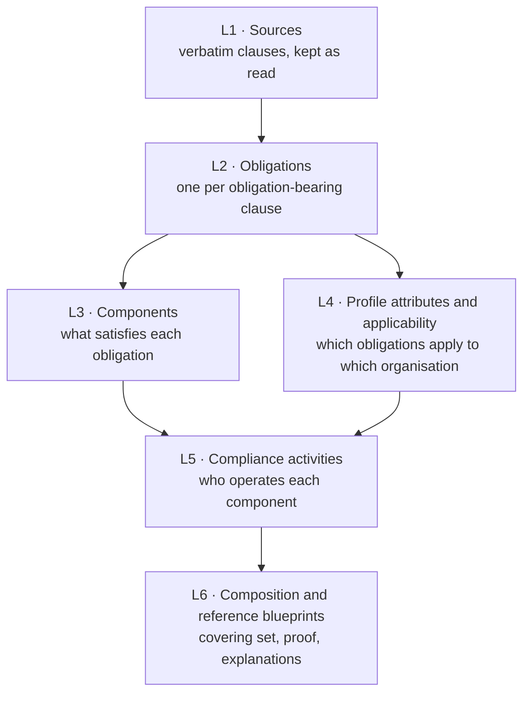

# How CLHEAR works

This page follows one run from texts to reference blueprint, layer by layer, and states the rules each layer applies. The [README](../README.md) covers installation and use.

## The idea in one paragraph

A regulation is a list of obligations written as prose. An organisation only has to meet the obligations that apply to it, and one well-chosen component (a process, a document, a role, a system) often satisfies several obligations at once. CLHEAR makes that reduction explicit. It reads the texts, pulls out the obligations with a pointer to each clause, asks the questions their applicability conditions raise about the organisation, and chooses a set of components that covers every applicable obligation, with a proof that none of them is redundant.

## Terms

| Term | Meaning |
| --- | --- |
| Source | An official text published by a lawmaker, regulator, court or standards body. It has a kind (`law`, `regulation`, `guidance`, `enforcement` …) and a publisher. |
| Publisher | Who issues a source, as registered with it (`issuer`). Source advice asks for further sources from the same publisher. |
| Clause | One unit of a source's text (an article, a section, a paragraph, a list item), kept exactly as read, with a stable reference such as `art-32/1`. |
| Stated obligation | What one clause requires its subject to do or not do. One clause may state several. |
| Obligation | The record derived from a stated obligation (`OBL:<source>#<clause_ref>`). Stated obligations in the same jurisdiction whose text is identical or nearly so are consolidated into one obligation. |
| Component | Something an organisation has in order to satisfy obligations. Its subclasses are System, Document, Role, Body, Process, Workflow, Asset and Configuration; `Unspecified` when the words do not say. |
| Characteristic | A property of a component (cadence, owner, retention …). It is "not stated" when the texts do not state it. |
| Organisation profile | The profile attribute values that describe one organisation: its jurisdictions, roles, conditions and licences. |
| Applicability condition | A question an obligation's own words raise (jurisdiction, role, condition), with its quote. The profile attribute values answer it. |
| Compliance activity | The quoted action an obligation requires, operated by the addressee the clause names. |
| Reference blueprint | The set of components that covers every applicable obligation for one profile and scope, with a proof that none is redundant. |
| Element | One component in a reference blueprint, with the obligations it satisfies and why it is there. |
| Evidence chain | The quotes that tie each record back to the clause text, checked again on every run. |
| Evidence gap | A record the texts in scope could not support: what is missing, and which kind of source would supply it. |
| Enforcement event | An enforcement action taken from an `enforcement` source and linked to the obligations it concerns. |
| Risk score | A score per obligation and per element, built from its enforcement events and other recorded inputs. |
| Practice | A guidance-derived practice: a quoted finding or piece of advice from a `guidance` source, linked to the component it concerns. |
| Cross-reference | A clause's mention of another text or provision ("section 2 of the Harbour Lighting Act 2019", "under Part 7"), kept with its quote and offsets. |
| Source inventory | Every source in scope and every text their clauses cite, each `derived` (read and built), `pending` (registered, not built) or `unresolved` (cited, not registered). |
| Source advice | For each layer that could not derive its records, the kinds of official source to add to L1 and the source kind to register each as; for a text the clauses cite but the scope does not hold, that text by name. |

## The evidence contract

L1 holds the official texts. Every record in L2 to L8 either quotes them or points at a lower-layer record that does. That is what keeps the engine independent of any sector: roles, conditions, licence types, components and compliance activities are the words of the texts in scope, so each installation's model of its domain grows from its own sources.

- **A quote** is `{"clause_id", "source_key", "clause_ref", "start", "end", "quote"}`, and `quote` equals the clause text between `start` and `end`. A value the model proposes is kept only when it is such a quote, or (for a component's or licence's name) when every word of it occurs in the cited clauses.
- **An evidence gap** is written when a record cannot be derived: which layer, which obligation or component, what is missing, and a recommendation naming the kind of source that would supply it. Gaps are rebuilt on every run and shown in the reference blueprint.
- **The engine's own data model is not evidence and needs none:** the component subclasses and their fields, the obligation grammar (modal verbs; "where / if / unless"; public bodies such as an authority, a department or a court), and the blueprint states. These describe how CLHEAR reads any text.
- **Lineage.** Before composing, a run re-checks every quote in the evidence chain of every record it derived for the scope against the stored clause text and the clause's in-force status. This is the anchoring check. A record that fails is withheld from the blueprint and listed in the release's `lineage.unanchored`.

## The layers

Each run builds a stack of layers for one scope. Every layer reads only the layers below it and records which input revisions it read. If an input changed after it was built, the dependent layer refuses to build rather than trusting stale input. Runs take turns, so two builds never interleave.

### L1: Sources

Each source is read by its **adapter**:

- `local_text` reads pasted text, or a text, HTML or PDF file under `CLHEAR_LOCAL_SOURCES_DIR`.
- `url` reads a public https page or PDF. Every redirect is checked, and private addresses are refused.
- Publisher adapters read an official feed: `eur_lex`, `uk_legislation`, `govinfo_us`.

For `local_text` and `url`, the original is rendered to UTF-8 text once. HTML keeps the main content's text blocks, PDF keeps each page's text layer, and plain text is kept as is. The rendering is stored as `source.txt`, with the original's hash and content type recorded beside it.

The text is split into clauses along its own structure:

- **Division headings** (Part, Title, Chapter, Annex, Schedule …) contain units.
- **Unit headings** (Article, Section, §, Rule, Clause, numbered headings such as `4.1 Context`) own the paragraphs after them. A bare `Article 5` absorbs the title on the next line.
- **Paragraphs** start at a blank line or at a line that opens with an enumerator (`1.`, `(2)`, `§ 4`). Very long paragraphs are split where a line ends a sentence.
- **List items** (`(a)`, `(iv)`) nest under the paragraph that introduces them when that paragraph ends with a colon.

References are readable and stable: `art-32/1`, `sec-4/b`, `p3`. The same text always gives the same references.

**Cross-references.** When a version is stored, every clause is read for the other texts and provisions it mentions, and each mention is kept with its quote and offsets (`app/clhear/l1/references.py`). The grammar is the generic grammar of legal drafting, the same for every sector: numbered provisions (section, article, regulation, rule, part, chapter, schedule, annex: "section 3(1)(a)", "Part 7", "§ 4"), texts named "the <Title> Act / Regulation / Rule / Directive / Code / Standard" with an optional year, numbered texts ("Regulation (AB) 2030/17"), and both together ("section 2 of the Harbour Lighting Act 2019"). A provision's own label, a title line, "this Act", "the Act" and the name a text gives itself are not references. A mention repeated in a parent clause is kept once, on the most specific clause.

Each build resolves the mentions against its scope. A cited text matches a source by the publisher's reference registered with it (`reference`) or by its name, ignoring case, a leading "the" and plurals (years must agree when both give one). A cited provision matches a clause by its reference (`section 3(1)` is `sec-3/1`, or at least `sec-3`). A bare provision is looked for in the citing text first. A cited text the scope does not hold becomes an `unresolved_reference` gap that names it as the clauses word it, with every clause that cites it.

Before a version is stored, an independent check confirms that every stored node is a run of whole, consecutive lines of `source.txt`, in order, covering all of it. A node that changed a word, dropped a line or reordered text fails the import. When a source changes, L1 stores a new version and the clause-level difference.

### L2: Obligations

A clause states an **obligation** when, read with its lead-in (a list item continues the sentence it belongs to), it says someone *must*, *shall*, *is required to*, *is obliged to* or *is prohibited from* doing something. These are excluded:

- **Structure:** clauses under headings such as Definitions, Scope, Entry into force, Repeals or Transitional. Only real heading words count, never words inside a sentence.
- **Procedure:** proceedings, hearings, appeals, penalties.
- **Obligations of authorities:** a supervisory or competent authority, the Commission, a court, an agency, a minister. An obligation that binds the regulator binds nobody in your organisation.
- **Construction:** "the provisions of … shall not apply", "the term … shall include", "shall be deemed".

Each stated obligation becomes an obligation `OBL:<source>#<clause_ref>` with:

- its sentence: for a list item, "Personal data shall be kept in a form …";
- its structure: subject, action, condition (the obligation's own "where / if / unless" clause) and object, each stored with its quote. A field read across a lead-in and its list item is two quotes;
- its verb as written ("keep", "notify", "not disclose"). No taxonomy of obligation types is imposed on the text;
- no invented addressee: an obligation that does not state who it binds says so.

Obligations in the same jurisdiction whose text is identical, or nearly so, are consolidated into one; nothing is deleted.

The model then helps in three bounded ways:

- **Triage.** Clauses with weaker wording ("should", "is expected to") are shown to the model. It must quote the words it relied on, verbatim, or the verdict is dropped.
- **Structure repair.** Where the rules could not split a sentence, the model may. Every field it returns must be the clause's own words, quoted; otherwise the answer is dropped.
- **Review.** A second reading marks each derivation correct, incorrect or unsure. Incorrect readings open a proposal for a person to decide.

### L3: Components

A **component** (`BLK-…`) is what an obligation tells the addressee to do or to have, in the obligation's words:

- The model reads the obligations in document order and groups them into components. It may cite only the obligations it was shown, and a name is kept only when every word of it occurs in those obligations' clauses. A rejected name is an evidence gap (`measure_name_rejected`), never a component.
- Any obligation still without a component gets one from its own words: the action ("review user access rights") or the thing to have ("an inventory of the systems …"), quoted. The subclass is read from the same words: an appointing verb gives a Role; a head noun such as policy, register or log gives a Document; system or software gives a System; otherwise an obligation to do something is a Process. When the words do not say, the kind is `Unspecified`.
- An obligation that names nothing concrete gets no component: it stays a `gap`, and an evidence gap (`no_measure`) recommends the guidance that would name one.
- Near-identical components are merged.
- A characteristic (cadence, owner, retention, approver …) is recorded only when a clause states it, with the quote. Each field the texts leave open is "not stated" and an evidence gap (`characteristic_unspecified`) naming the guidance that would specify it.

### L4: Profile attributes and applicability

An obligation's applicability conditions are the questions its own words raise. Each is recorded with its quote:

| Applicability condition | Comes from | Example |
| --- | --- | --- |
| jurisdiction | the jurisdiction the source is registered with | `{"jurisdictions": "EU"}` |
| role | the addressee the obligation names, when it is not "every organisation" / "any person" / a pronoun | "The controller and the processor shall …" → `{"roles": ["controller", "processor"]}` |
| condition | the obligation's own "where / if / unless / to the extent that" clause, when it is about the addressee | "Where an organisation processes personal data, it shall …" → `{"condition": "COND-…", "fact": "processes personal data", "expect": true}` |

A few grammatical rules keep the questions honest. A passive obligation ("personal data shall be kept …") and an obligation that sets content ("the notice shall include …") name no addressee. A relative clause on the addressee ("a firm that holds client money") is a condition. When the subject is a pronoun ("where a covered entity maintains …, it must …"), the condition's noun phrase is the addressee. A clause about an event rather than the addressee ("where an incident is likely to harm them", "when they join") times the obligation and is shown on it as a trigger; it does not decide whether the obligation applies.

**The rule** is three-valued. An obligation *applies* when every applicability condition is answered and matches the organisation profile, is *not applicable* when an answer fails (the failed condition and its quote are the reason), and is *undetermined* while any question it raises has no answer. An obligation with no applicability conditions applies to every organisation.

`GET /v1/profile-schema?scope=<name>` (or `clhear profile questions --scope <name>`) lists the questions a built scope raises, with quotes. The answers are the profile attribute values. A role that no text in scope defines is an evidence gap (`role_undefined`).

**Candidate organisation profiles** are listed with the questions: one per role the obligations name ("You are 'operator'"), with the scope's jurisdictions and the conditions that role's obligations still depend on, and one per licence type ("You hold '…'"), with any role that shares its words. A candidate is only ever built from roles and licences quoted from the texts in scope; no combination is invented.

**Licence types** are read only from the scope's clauses that use the words of licensing (licence, permit, registration, authorisation, certificate, accreditation). The model sees only those clauses, must cite one per type, and a name is kept only when its words are in that clause. When none is found, the blueprint carries a `no_licence_types` gap.

### L5: Compliance activities

Every obligation with a component is mapped to a **compliance activity**: its action, quoted ("review user access rights"), operated by the addressee the clause names ("the management body"). A compliance activity operates the components its obligations require. When the text addresses everyone or is written in the passive, it does not say who carries the obligation out; the compliance activity has no operator and an evidence gap (`operator_not_stated`) says so. No activity catalogue, owner or business process is filled in. Compliance activities never decide applicability: that is L4's job alone.

### L6: Composition, which produces the reference blueprint

For one organisation profile, over the run's scope only:

1. Every obligation in scope gets a verdict from L4: it applies, it does not (the failed conditions are listed), or it is undetermined (the open questions are listed, and gathered as `open_questions`).
2. Every component an applicable obligation **requires** is taken (`basis: required`).
3. A greedy set cover picks the fewest further components for the remaining obligations (`basis: selected`), and a pruning pass removes any that became redundant.
4. The **minimality proof** records, for each component, the obligations only it satisfies and what would become a gap without it.
5. Each element gets an **explanation** that cites its obligations, quotes the clause, and names the profile attribute values that made them apply.
6. The evidence gaps that concern this blueprint are attached, each with its recommendation.

The result is a pure function of its inputs: same scope, profile and layers give the same blueprint. Blueprints are stored under `BLU-…` ids. A newer blueprint for the same profile and scope supersedes the older one, and nothing is deleted, which is what makes `diff` possible.

## Offline sample vs. live run

| | `CLHEAR_LLM_PROVIDER=fake` | `anthropic` / `openai_compatible` / `bedrock` |
| --- | --- | --- |
| What runs | A fixed sample: one placeholder obligation per source | The full L1 to L6 build over your scope |
| Use it for | Seeing the blueprint shape | Real blueprints |
| Blueprint | Marked `"sample": true` | Real |

### L7 and L8

L7 (Risk scoring: enforcement events and risk scores) builds only from sources of kind `enforcement` in the scope, and L8 (Practices: guidance-derived practices) only from sources of kind `guidance`. Without one, the layer is recorded as not built, makes no model call, and the blueprint carries a gap recommending the source to add.

## Source advice: what to add to L1

Every layer derives its records from L1 alone, so a layer with nothing to derive them from is answered with advice, not with made-up records. The source advisor (`app/clhear/advisor.py`) turns each kind of evidence gap into the kinds of official source that would let that layer derive its records, why, and the source `kind` to register each as:

| Layer | Gap | Add |
| --- | --- | --- |
| L1 | `no_text` | The official publication, readable (HTML, or a PDF with a text layer) |
| L1 | `unresolved_reference` | The cited text itself, named as the clauses word it, with the clauses that cite it (`law` for an Act or Code, `standard` for a Standard, otherwise `regulation`; a bare provision takes the kind of the text citing it). When the text is registered but not in the scope, the advice says to add it to the scope. |
| L2 | `no_duties` | The binding act or regulation in full (`law`, `regulation`) |
| L3 | `no_measure`, `measure_name_rejected`, `characteristic_unspecified` | Implementing guidance, recognised standards, codes of practice (`guidance`, `standard`) |
| L4 | `no_licence_types`, `role_undefined` | Licensing, registration or scope-of-practice rules; definitions sections; coverage guidance (`regulation`, `law`, `guidance`) |
| L5 | `operator_not_stated` | Rules or guidance that designate a responsible officer or function (`guidance`, `regulation`) |
| L7 | `no_enforcement_sources` | Enforcement actions, consent orders, settlements, penalty notices, warning letters, resolution agreements (`enforcement`) |
| L8 | `no_reference_sources` | FAQs and official Q&As, guidance and bulletins, inspection findings, court and tribunal decisions, official journals (`guidance`) |

The advice is the same for every sector. It names no regulation or authority from a list: when the sources in scope were registered with a publisher (`issuer`), it asks for the further sources from that publisher. News is never evidence; the advice says it may point to an official source to register instead. Undetermined obligations are not a source gap, and the advice points to the open questions instead. The advice for a blueprint's own gaps is in its `source_advice`; the release and `GET /v1/scopes/{name}/advice` carry it for the whole scope.

Each blueprint also carries a `source_inventory`, and `GET /v1/scopes/{name}/advice` returns it for the scope. It lists every source in scope and every text their clauses cite, each with a status:

- `derived`: in scope, its text read and built (with its clause count, and the clauses of other sources that cite it);
- `pending`: registered but not built: in scope but not read yet or unreadable (with the reason), or cited and registered but not in this scope;
- `unresolved`: cited by the clauses in scope, not registered (with the kind to register it as).

A source that is missing is thereby told apart from one that does not apply.

## Honesty guarantees

- A run where no source produced text fails, and says which source failed and why.
- A layer where every model call failed (bad key, wrong model, spend cap) fails the run with the last error. Partial failures are counted in the release's `model_calls`.
- `source.failed` fires only for sources that did not import.
- Every obligation in scope is covered, a gap, not applicable with a reason, or undetermined with its question. None is dropped.
- Every record in the blueprint quotes its clause, and the evidence chain is checked again on every run. What cannot be quoted is withheld or reported as an evidence gap, never filled in.

## Code map

| Path | What lives there |
| --- | --- |
| `app/clhear/cli.py`, `app/clhear/api.py` | The `clhear` command and the `/v1` HTTP API |
| `app/clhear/runner.py`, `app/clhear/scope_build.py` | One queued run; the layer-by-layer build of a scope |
| `app/clhear/l1/adapters/document.py` | Text, HTML and PDF sources: rendering, clause structure, verification |
| `app/clhear/evidence.py`, `app/clhear/lineage.py` | Quotes and evidence gaps; the anchoring check |
| `app/clhear/l1/references.py` | Cross-references: the generic citation grammar, and their resolution against a scope |
| `app/clhear/advisor.py` | Which official sources to add to L1, per gap and layer; the source inventory |
| `app/clhear/first_run.py` | Source preview, profile storage and the readable text the CLI prints |
| `app/clhear/l2/extract.py`, `l2/registry.py` | Obligation detection rules; structure and its quotes |
| `app/clhear/l3/generate.py`, `l3/decompose.py`, `l3/kinds.py` | Components from the model; from the obligation's own words; the subclasses |
| `app/clhear/l4/predicates.py`, `l4/validate.py` | Applicability conditions read from the text, the three-valued rule; profiles |
| `app/clhear/l5/map.py` | Compliance activities and their operators, quoted |
| `app/clhear/l6/composer.py` | Set cover, minimality proof, blueprint |
| `app/clhear/platform/gateway.py` | Model providers, retries, spend caps, call ledger |
| `migrations/` | Numbered schema migrations, applied on startup |
| `openapi/clhear-v1.yaml` | The API contract, checked against the app in CI |
| `tests/engine/` | The live path end to end, with a scripted stand-in model |
