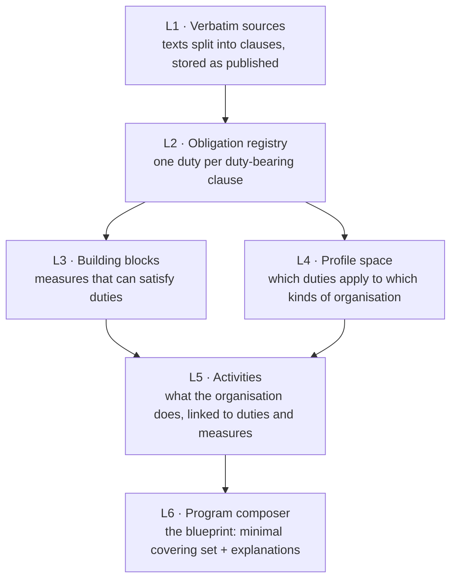

# How CLHEAR works

This page follows one run from texts to blueprint. The [README](../README.md) covers installation and day-to-day use.

## The idea in one paragraph

A regulation is a list of duties hidden in prose. An organisation only has to meet the duties that apply to it, and one well-chosen measure (a process, a control, a record) often meets several duties at once. CLHEAR makes that reduction explicit. It reads the texts, pulls out the duties with a pointer to each clause, filters them by the organisation's facts, and then solves for the **smallest set of measures that covers every applicable duty**. It keeps a proof that nothing in the set is redundant.

## The layers

Each run builds a stack of layers. Every layer reads only the layer or layers below it, and records which input revisions it read. If an input changes after a layer was built, that layer is rebuilt rather than trusted.

### L1: Verbatim sources

Each source in the scope is fetched by its **adapter** (`local_text` for pasted text or a file, or a publisher adapter for a URL). The original bytes are kept, the text is split into a tree of nodes and **clauses**, and each clause gets a stable reference (`clause_ref`) and a content hash. Nothing is paraphrased. A readback check compares the stored clauses with the original before the version is accepted.

When a source changes, L1 records a new version and the clause-level difference. Everything above L1 that cited a changed clause is flagged for re-derivation.

### L2: Obligation registry

Every clause that imposes a duty becomes an **obligation** with the id `OBL:{source_key}#{clause_ref}`. The first pass is deterministic: lexical and structural rules decide whether a clause carries a duty, so the same corpus always derives the same registry. The model then triages borderline duties, fills in structure (who must do what, when), and proposes merges of near-duplicates. Each obligation stores the hash of its basis clause.

### L3: Building blocks

A **building block** is a measure an organisation can put in place: a process, a control, a record, a policy. It has the id `BLK-…`. Blocks declare which obligations they satisfy, and those anchors must resolve to live obligations. Near-duplicate blocks are merged. A duty that names a specific measure creates a `requires` edge to that block.

### L4: Profile space

L4 turns the **profile** facts (`jurisdictions`, `authorisations`, `products`, `customer_base`, `channels`, `data_footprint`, `crypto_services`, `financial_entity_dora`) into applicability. Each obligation carries an `applies_to` predicate over those facts, and each stored profile is validated against the ontology so impossible combinations are flagged.

### L5: Activities

L5 connects duties to what the organisation actually does. Every obligation is mapped to a compliance **activity** (screen, monitor, report, record, train, test, and so on), and activities are linked to the blocks that operate them. Nothing is left unmapped: an obligation with no clear cue maps to the activity that operates the block it requires.

### L6: Program composer, which produces the blueprint

For one profile, the composer:

1. collects the obligations whose applicability predicates match the profile (L4) and whose activities are triggered (L5);
2. adds every block a duty **requires** (`basis: required`);
3. runs a greedy **set cover** over the remaining obligations to pick the fewest additional blocks (`basis: selected`), then prunes anything that became redundant;
4. writes the **minimality proof**: for each item, the obligations only it satisfies and what would become a gap without it;
5. writes an **explanation** for each item, checked against a fixed rubric.

The composition is a pure function of its inputs: the same profile and the same layers always produce the same blueprint. Blueprints are stored under a `BLU-…` id. A newer blueprint for the same profile supersedes the older one, and nothing is deleted, which is what makes `GET /v1/blueprints/{id}/diff` possible.

Gaps are never hidden. An applicable duty that no block satisfies appears in `coverage` with a state other than `covered`.

### Further layers

The engine also contains **L7 (risk scoring)**, which weighs obligations by linked enforcement outcomes and change velocity, and **L8 (benchmarks)**. They only produce output when the scope includes the kind of sources they read, such as enforcement publications. A typical run needs only L1 to L6.

## Offline sample vs. live run

| | `CLHEAR_LLM_PROVIDER=fake` | `anthropic` / `openai_compatible` / `bedrock` |
| --- | --- | --- |
| What runs | A fixed sample derivation, no network | The full L1 to L6 build over your scope |
| Use it for | Seeing the blueprint shape, CI, tests | Real blueprints |
| `clhear doctor` | `"live_run": "blocked"`, exit 0 | `"live_run": "ready"` once credentials are set |

## Where things are kept

- **Database** (`DATABASE_URL`): sources, clauses, derived layers, profiles, runs, releases, webhooks.
- **Artifacts directory** (`CLHEAR_ARTIFACTS_DIR`): original bytes fetched from publishers.
- **Scopes directory** (`CLHEAR_SCOPES_DIR`): one YAML file per scope.

Firm identity, existing controls, owners and evidence files are never asked for, and they stay in your own systems.

## Code map

| Path | What lives there |
| --- | --- |
| `app/clhear/cli.py` | The `clhear` command |
| `app/clhear/api.py` | The `/v1` HTTP API |
| `app/clhear/runner.py` | Executes one queued run |
| `app/clhear/scope_build.py` | Builds every layer for one scope |
| `app/clhear/l1/` … `app/clhear/l8/` | One package per layer |
| `app/clhear/l1/adapters/` | How each kind of source is read |
| `app/clhear/curated/` | Reviewed reference data (profile schema, ontology, seed blocks and activities) |
| `migrations/` | Numbered schema migrations, applied on startup |
| `openapi/clhear-v1.yaml` | The API contract, checked against the app in CI |
