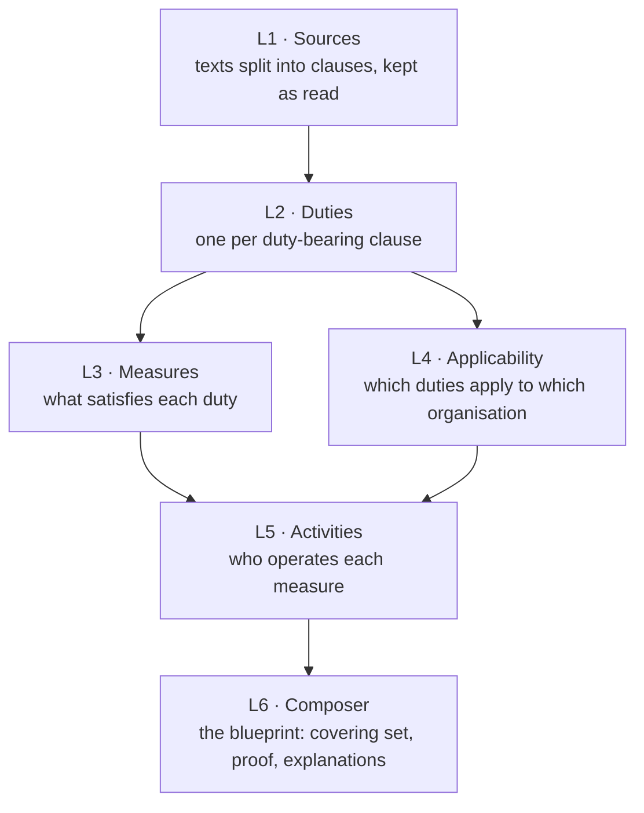

# How CLHEAR works

This page follows one run from texts to blueprint, layer by layer, and states the rules each layer applies. The [README](../README.md) covers installation and use.

## The idea in one paragraph

A regulation is a list of duties written as prose. An organisation only has to meet the duties that apply to it, and one well-chosen measure (a process, a record, a role, a system) often meets several duties at once. CLHEAR makes that reduction explicit. It reads the texts, pulls out the duties with a pointer to each clause, decides which apply to the organisation's facts, and chooses a set of measures that covers every applicable duty, with a proof that none of them is redundant.

## The layers

Each run builds a stack of layers for one scope. Every layer reads only the layers below it and records which input revisions it read. If an input changed after it was built, the dependent layer refuses to build rather than trusting stale input. Runs take turns, so two builds never interleave.

### L1: Sources

Each source is read by its **adapter**:

- `local_text` reads pasted text, or a text, HTML or PDF file under `CLHEAR_LOCAL_SOURCES_DIR`.
- `url` reads a public https page or PDF. Every redirect is checked, and private addresses are refused.
- Publisher adapters read an official feed: `eur_lex`, `uk_legislation`, `govinfo_us`.

For `local_text` and `url`, the original is rendered to UTF-8 text once. HTML keeps the main content's text blocks, PDF keeps each page's text layer, and plain text is kept as is. The rendering is stored as `source.txt`, with the original's hash and content type recorded beside it.

The text is split into clauses along its own structure:

- **Division headings** (Part, Title, Chapter, Annex, Schedule …) contain units.
- **Unit headings** (Article, Section, §, Rule, Clause, numbered headings such as `4.1 Context`) own the paragraphs after them. A bare `Article 5` absorbs the title on the next line.
- **Paragraphs** start at a blank line or at a line that opens with an enumerator (`1.`, `(2)`, `§ 4`). Very long paragraphs are split where a line ends a sentence.
- **List items** (`(a)`, `(iv)`) nest under the paragraph that introduces them when that paragraph ends with a colon.

References are readable and stable: `art-32/1`, `sec-4/b`, `p3`. The same text always gives the same references.

Before a version is stored, an independent check confirms that every stored node is a run of whole, consecutive lines of `source.txt`, in order, covering all of it. A node that changed a word, dropped a line or reordered text fails the import. When a source changes, L1 stores a new version and the clause-level difference.

### L2: Duties

A clause is a **duty** when, read with its lead-in (a list item continues the sentence it belongs to), it says someone *must*, *shall*, *is required to*, *is obliged to* or *is prohibited from* doing something. These are excluded:

- **Structure:** clauses under headings such as Definitions, Scope, Entry into force, Repeals or Transitional. Only real heading words count, never words inside a sentence.
- **Procedure:** proceedings, hearings, appeals, penalties.
- **Duties of authorities:** a supervisory or competent authority, the Commission, a court, an agency, a minister. A duty that binds the regulator binds nobody in your organisation.
- **Construction:** "the provisions of … shall not apply", "the term … shall include", "shall be deemed".

Each duty becomes an obligation `OBL:<source>#<clause_ref>` with:

- its sentence: for a list item, "Personal data shall be kept in a form …";
- its structure: subject, action, condition (the duty's own "where / if / unless" clause) and object;
- a type: record keeping, reporting, disclosure, security, data protection, risk management, training, governance and so on.

The model then helps in three bounded ways:

- **Triage.** Clauses with weaker wording ("should", "is expected to") are shown to the model. It must quote the words it relied on, verbatim, or the verdict is dropped.
- **Structure repair.** Where the rules could not split a sentence, the model may, using only words from the clause.
- **Review.** A second reading marks each derivation correct, incorrect or unsure. Incorrect readings open a proposal for a person to decide.

### L3: Measures

Every duty gets at least one **measure** (`BLK-…`):

- Duties without one are grouped by type and shown to the model in batches. It proposes one concrete measure per batch and may cite only the duties it was shown. A proposal that matches an existing measure's name is linked to that measure instead of creating a near-duplicate.
- Any duty still without a measure gets one deterministically from its own words, reusing an existing measure of the same kind when the names match.
- Near-identical measures are merged.
- Each measure's characteristics (cadence, owner, trigger …) are filled from the duty texts, or marked "not specified by source".

### L4: Applicability

A duty's **conditions** are recorded as edges, each with the words it came from:

| Edge | Comes from | Example |
| --- | --- | --- |
| jurisdiction | the source's declared jurisdiction | `{"jurisdictions": "EU"}` |
| subject | who the text addresses | "the controller" → `{"data_footprint": "*"}` |
| condition | the duty's own where/if clause | "where an organisation processes personal data" → `{"data_footprint": "*"}` |
| model | a quoted, closed-world reading, only for duties the rules could not read | |

**The rule:** a duty applies to an organisation when every one of its edges matches the profile. A duty with no edges applies to every organisation. Words elsewhere in a sentence ("online", "consumers") describe the duty; they never narrow it.

`GET /v1/profile-schema` lists the profile fields, what each one changes, and the values this install knows. By default the ontology (jurisdictions, licences, products) comes only from your own sources. `CLHEAR_CURATED_FINANCE=1`, set before the first migration, seeds a reviewed UK/EU/US financial-services ontology instead.

### L5: Activities

Every duty is mapped to an **activity** that operates its measure (record, report, notify, train, test, monitor …). Activities give each measure an operator and connect duties that share one. They never decide applicability: that is L4's job alone.

### L6: Composer, which produces the blueprint

For one profile, over the run's scope only:

1. Every duty in scope gets a verdict from L4: it applies, or it does not and the failed edges are listed.
2. Every measure an applicable duty **requires** is taken (`basis: required`).
3. A greedy set cover picks the fewest further measures for the remaining duties (`basis: selected`), and a pruning pass removes any that became redundant.
4. The **minimality proof** records, for each measure, the duties only it satisfies and what would become a gap without it.
5. Each measure gets an **explanation** that cites its duties and the profile facts that made them apply.

The result is a pure function of its inputs: same scope, profile and layers give the same blueprint. Blueprints are stored under `BLU-…` ids. A newer blueprint for the same profile and scope supersedes the older one, and nothing is deleted, which is what makes `diff` possible.

## Offline sample vs. live run

| | `CLHEAR_LLM_PROVIDER=fake` | `anthropic` / `openai_compatible` / `bedrock` |
| --- | --- | --- |
| What runs | A fixed sample: one placeholder duty per source | The full L1 to L6 build over your scope |
| Use it for | Seeing the blueprint shape | Real blueprints |
| Blueprint | Marked `"sample": true` | Real |

## Honesty guarantees

- A run where no source produced text fails, and says which source failed and why.
- A layer where every model call failed (bad key, wrong model, spend cap) fails the run with the last error. Partial failures are counted in the release's `model_calls`.
- `source.failed` fires only for sources that did not import.
- Every duty in scope is covered, a gap, or not applicable with a reason. None is dropped.

## Code map

| Path | What lives there |
| --- | --- |
| `app/clhear/cli.py`, `app/clhear/api.py` | The `clhear` command and the `/v1` HTTP API |
| `app/clhear/runner.py`, `app/clhear/scope_build.py` | One queued run; the layer-by-layer build of a scope |
| `app/clhear/l1/adapters/document.py` | Text, HTML and PDF sources: rendering, clause structure, verification |
| `app/clhear/l2/extract.py` | Duty detection rules |
| `app/clhear/l3/generate.py`, `l3/decompose.py` | Measures from the model; the deterministic fallback |
| `app/clhear/l4/predicates.py` | Applicability edges and the applicability rule |
| `app/clhear/l6/composer.py` | Set cover, minimality proof, blueprint |
| `app/clhear/platform/gateway.py` | Model providers, retries, spend caps, call ledger |
| `migrations/` | Numbered schema migrations, applied on startup |
| `openapi/clhear-v1.yaml` | The API contract, checked against the app in CI |
| `tests/engine/` | The live path end to end, with a scripted stand-in model |
