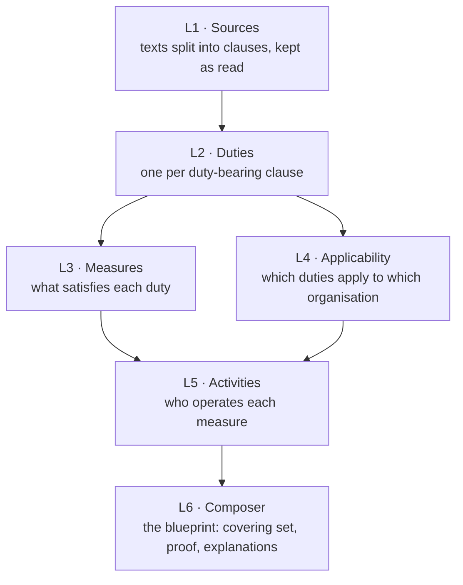

# How CLHEAR works

This page follows one run from texts to blueprint, layer by layer, and states the rules each layer applies. The [README](../README.md) covers installation and use.

## The idea in one paragraph

A regulation is a list of duties written as prose. An organisation only has to meet the duties that apply to it, and one well-chosen measure (a process, a record, a role, a system) often meets several duties at once. CLHEAR makes that reduction explicit. It reads the texts, pulls out the duties with a pointer to each clause, asks the questions those duties raise about the organisation, and chooses a set of measures that covers every applicable duty, with a proof that none of them is redundant.

## The evidence contract

L1 holds the official texts. Every record in L2 to L8 either quotes them or points at a lower-layer record that does. That is what keeps the engine independent of any sector: roles, conditions, licence types, measures and activities are the words of the texts in scope, so each installation's model of its domain grows from its own sources.

- **A quote** is `{"clause_id", "source_key", "clause_ref", "start", "end", "quote"}`, and `quote` equals the clause text between `start` and `end`. A value the model proposes is kept only when it is such a quote, or (for a measure's or licence's name) when every word of it occurs in the cited clauses.
- **An evidence gap** is written when a record cannot be derived: which layer, which duty or measure, what is missing, and a recommendation naming the kind of source that would supply it. Gaps are rebuilt on every run and shown in the blueprint.
- **The engine's own data model is not evidence and needs none:** the measure kinds and their fields, the duty grammar (modal verbs; "where / if / unless"; public bodies such as an authority, a department or a court), and the blueprint states. These describe how CLHEAR reads any text.
- **Lineage.** Before composing, a run re-checks every quote of every record it derived for the scope against the stored clause text and the clause's in-force status. A record that fails is withheld from the blueprint and listed in the release's `lineage.unanchored`.

## The layers

Each run builds a stack of layers for one scope. Every layer reads only the layers below it and records which input revisions it read. If an input changed after it was built, the dependent layer refuses to build rather than trusting stale input. Runs take turns, so two builds never interleave.

### L1: Sources

Each source is read by its **adapter**:

- `local_text` reads pasted text, or a text, HTML or PDF file under `CLHEAR_LOCAL_SOURCES_DIR`.
- `url` reads a public https page or PDF. Every redirect is checked, and private addresses are refused.
- Publisher adapters read an official feed: `eur_lex`, `uk_legislation`, `govinfo_us`.

For `local_text` and `url`, the original is rendered to UTF-8 text once. HTML keeps the main content's text blocks, PDF keeps each page's text layer, and plain text is kept as is. The rendering is stored as `source.txt`, with the original's hash and content type recorded beside it.

The text is split into clauses along its own structure:

- **Division headings** (Part, Title, Chapter, Annex, Schedule …) contain units.
- **Unit headings** (Article, Section, §, Rule, Clause, numbered headings such as `4.1 Context`) own the paragraphs after them. A bare `Article 5` absorbs the title on the next line.
- **Paragraphs** start at a blank line or at a line that opens with an enumerator (`1.`, `(2)`, `§ 4`). Very long paragraphs are split where a line ends a sentence.
- **List items** (`(a)`, `(iv)`) nest under the paragraph that introduces them when that paragraph ends with a colon.

References are readable and stable: `art-32/1`, `sec-4/b`, `p3`. The same text always gives the same references.

Before a version is stored, an independent check confirms that every stored node is a run of whole, consecutive lines of `source.txt`, in order, covering all of it. A node that changed a word, dropped a line or reordered text fails the import. When a source changes, L1 stores a new version and the clause-level difference.

### L2: Duties

A clause is a **duty** when, read with its lead-in (a list item continues the sentence it belongs to), it says someone *must*, *shall*, *is required to*, *is obliged to* or *is prohibited from* doing something. These are excluded:

- **Structure:** clauses under headings such as Definitions, Scope, Entry into force, Repeals or Transitional. Only real heading words count, never words inside a sentence.
- **Procedure:** proceedings, hearings, appeals, penalties.
- **Duties of authorities:** a supervisory or competent authority, the Commission, a court, an agency, a minister. A duty that binds the regulator binds nobody in your organisation.
- **Construction:** "the provisions of … shall not apply", "the term … shall include", "shall be deemed".

Each duty becomes an obligation `OBL:<source>#<clause_ref>` with:

- its sentence: for a list item, "Personal data shall be kept in a form …";
- its structure: subject, action, condition (the duty's own "where / if / unless" clause) and object, each stored with its quote. A field read across a lead-in and its list item is two quotes;
- its verb as written ("keep", "notify", "not disclose"). No taxonomy of duty types is imposed on the text;
- no invented addressee: a duty that does not state who it binds says so.

The model then helps in three bounded ways:

- **Triage.** Clauses with weaker wording ("should", "is expected to") are shown to the model. It must quote the words it relied on, verbatim, or the verdict is dropped.
- **Structure repair.** Where the rules could not split a sentence, the model may. Every field it returns must be the clause's own words, quoted; otherwise the answer is dropped.
- **Review.** A second reading marks each derivation correct, incorrect or unsure. Incorrect readings open a proposal for a person to decide.

### L3: Measures

A **measure** (`BLK-…`) is what a duty tells the addressee to do or to have, in the duty's words:

- The model reads the duties in document order and groups them into measures. It may cite only the duties it was shown, and a name is kept only when every word of it occurs in those duties' clauses. A rejected name is an evidence gap (`measure_name_rejected`), never a measure.
- Any duty still without a measure gets one from its own words: the action ("review user access rights") or the thing to have ("an inventory of the systems …"), quoted. The kind is read from the same words: an appointing verb gives a Role; a head noun such as policy, register or log gives a Document; system or software gives a System; otherwise a duty to do something is a Process. When the words do not say, the kind is `Unspecified`.
- A duty that names nothing concrete gets no measure: it stays a `gap`, and an evidence gap (`no_measure`) recommends the guidance that would name one.
- Near-identical measures are merged.
- A characteristic (cadence, owner, retention, approver …) is recorded only when a clause states it, with the quote. Each field the texts leave open is an evidence gap (`characteristic_unspecified`) naming the guidance that would specify it.

### L4: Applicability

A duty's conditions are the questions its own words raise. Each is recorded as an edge with its quote:

| Edge | Comes from | Example |
| --- | --- | --- |
| jurisdiction | the jurisdiction the source is registered with | `{"jurisdictions": "EU"}` |
| role | the addressee the duty names, when it is not "every organisation" / "any person" / a pronoun | "The controller and the processor shall …" → `{"roles": ["controller", "processor"]}` |
| condition | the duty's own "where / if / unless / to the extent that" clause, when it is about the addressee | "Where an organisation processes personal data, it shall …" → `{"condition": "COND-…", "fact": "processes personal data", "expect": true}` |

A few grammatical rules keep the questions honest. A passive duty ("personal data shall be kept …") and a duty that sets content ("the notice shall include …") name no addressee. A relative clause on the addressee ("a firm that holds client money") is a condition. When the subject is a pronoun ("where a covered entity maintains …, it must …"), the condition's noun phrase is the addressee. A clause about an event rather than the addressee ("where an incident is likely to harm them", "when they join") times the duty and is shown on it as a trigger; it does not decide whether the duty applies.

**The rule** is three-valued. A duty *applies* when every edge is answered and matches the profile, is *not applicable* when an answer fails (the failed edge and its quote are the reason), and is *undetermined* while any question it raises has no answer. A duty with no edges applies to every organisation.

`GET /v1/profile-schema?scope=<name>` lists the questions a built scope raises, with quotes. A role that no text in scope defines is an evidence gap (`role_undefined`).

**Licence types** are read only from the scope's clauses that use the words of licensing (licence, permit, registration, authorisation, certificate, accreditation). The model sees only those clauses, must cite one per type, and a name is kept only when its words are in that clause. When none is found, the blueprint carries a `no_licence_types` gap.

### L5: Activities

Every duty with a measure is mapped to an **activity**: its action, quoted ("review user access rights"), operated by the addressee the clause names ("the management body"). An activity operates the measures its duties require. When the text addresses everyone or is written in the passive, it does not say who carries the duty out; the activity has no operator and an evidence gap (`operator_not_stated`) says so. No activity catalogue, owner or business process is filled in. Activities never decide applicability: that is L4's job alone.

### L6: Composer, which produces the blueprint

For one profile, over the run's scope only:

1. Every duty in scope gets a verdict from L4: it applies, it does not (the failed edges are listed), or it is undetermined (the open questions are listed, and gathered as `open_questions`).
2. Every measure an applicable duty **requires** is taken (`basis: required`).
3. A greedy set cover picks the fewest further measures for the remaining duties (`basis: selected`), and a pruning pass removes any that became redundant.
4. The **minimality proof** records, for each measure, the duties only it satisfies and what would become a gap without it.
5. Each measure gets an **explanation** that cites its duties, quotes the clause, and names the profile answers that made them apply.
6. The evidence gaps that concern this blueprint are attached, each with its recommendation.

The result is a pure function of its inputs: same scope, profile and layers give the same blueprint. Blueprints are stored under `BLU-…` ids. A newer blueprint for the same profile and scope supersedes the older one, and nothing is deleted, which is what makes `diff` possible.

## Offline sample vs. live run

| | `CLHEAR_LLM_PROVIDER=fake` | `anthropic` / `openai_compatible` / `bedrock` |
| --- | --- | --- |
| What runs | A fixed sample: one placeholder duty per source | The full L1 to L6 build over your scope |
| Use it for | Seeing the blueprint shape | Real blueprints |
| Blueprint | Marked `"sample": true` | Real |

### L7 and L8

L7 (enforcement records and risk scores) builds only from sources of kind `enforcement` in the scope, and L8 (reference practice) only from sources of kind `guidance`. Without one, the layer is recorded as not built, makes no model call, and the blueprint carries a gap recommending the source to add.

## Honesty guarantees

- A run where no source produced text fails, and says which source failed and why.
- A layer where every model call failed (bad key, wrong model, spend cap) fails the run with the last error. Partial failures are counted in the release's `model_calls`.
- `source.failed` fires only for sources that did not import.
- Every duty in scope is covered, a gap, not applicable with a reason, or undetermined with its question. None is dropped.
- Every record in the blueprint quotes its clause, and the quotes are checked again on every run. What cannot be quoted is withheld or reported as an evidence gap, never filled in.

## Code map

| Path | What lives there |
| --- | --- |
| `app/clhear/cli.py`, `app/clhear/api.py` | The `clhear` command and the `/v1` HTTP API |
| `app/clhear/runner.py`, `app/clhear/scope_build.py` | One queued run; the layer-by-layer build of a scope |
| `app/clhear/l1/adapters/document.py` | Text, HTML and PDF sources: rendering, clause structure, verification |
| `app/clhear/evidence.py`, `app/clhear/lineage.py` | Quotes, evidence gaps and their recommendations; the lineage check |
| `app/clhear/l2/extract.py`, `l2/registry.py` | Duty detection rules; structure and its quotes |
| `app/clhear/l3/generate.py`, `l3/decompose.py`, `l3/kinds.py` | Measures from the model; from the duty's own words; the kinds |
| `app/clhear/l4/predicates.py`, `l4/validate.py` | Questions read from the text, the three-valued rule; profiles |
| `app/clhear/l5/map.py` | Activities and their operators, quoted |
| `app/clhear/l6/composer.py` | Set cover, minimality proof, blueprint |
| `app/clhear/platform/gateway.py` | Model providers, retries, spend caps, call ledger |
| `migrations/` | Numbered schema migrations, applied on startup |
| `openapi/clhear-v1.yaml` | The API contract, checked against the app in CI |
| `tests/engine/` | The live path end to end, with a scripted stand-in model |
